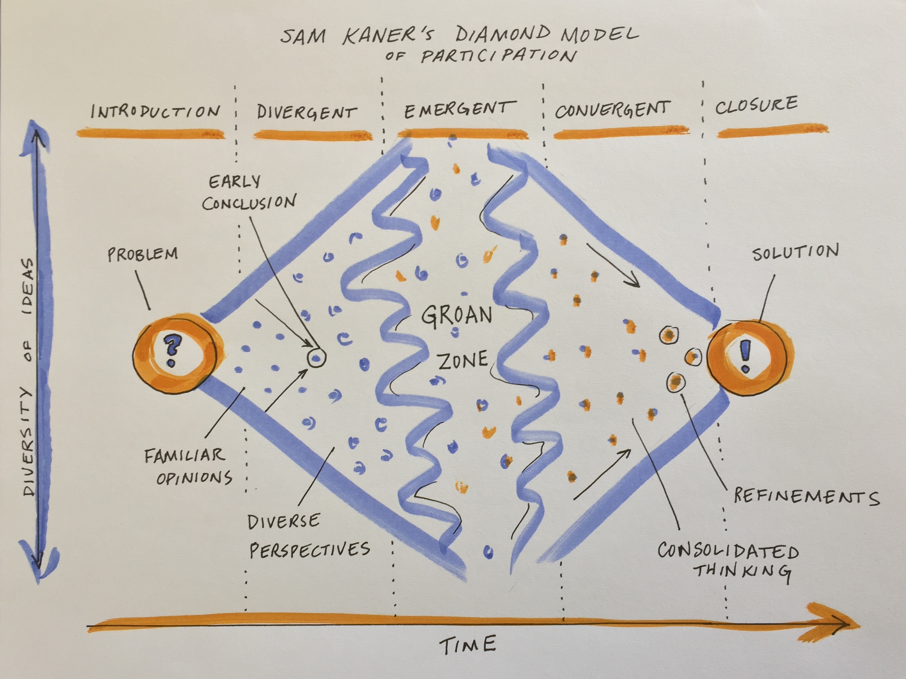
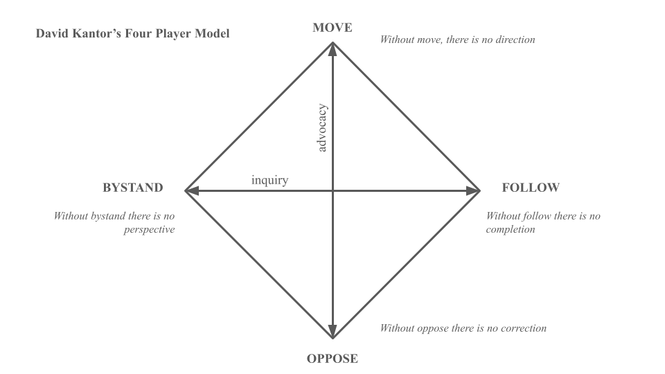
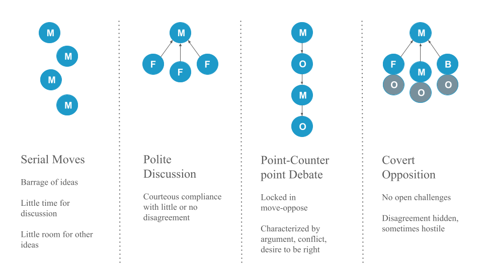

:::{.callout-tip}
### Learning Objectives

After completing this session, you will be able to:

- Identify the value of and potential obstacles to emergent thinking in the "groan zone"
- Understand the diamond model of participatory decision making as a framework for group process design
- Develop strategies to support participation, innovative thinking, integration, and convergence/decision making in a team setting
- Identify methods for ensuring equitable access to participation in a team setting
- Identify one activity that privileges each thinking style
- Describe benefits of encouraging full, thoughtful, engaged participation

:::

## Collaborative Convergence

At the beginning of a collaborative process, the most important initial outcome is getting convergence or group alignment on a set of shared goals and objectives and a plan for how to achieve them. If your team process is effective, this plan will be an _inclusive solution_--one that works for everyone in the group. Achieving this shared vision can be more difficult than one might expect. While you may expect that participants have already agreed to the vision in joining the group, agreement does not always equate to alignment. This module focuses on tools and resources to help your group navigate to convergent, inclusive solutions that everyone on the team can align around.

## Embracing Divergent Thinking

The first stage of group decision making is divergent thinking (Kaner et al. 2014). Confronted with a new, complex topic, the group will gradually move from the safe territory of familiar opinions into sharing their diverse perspectives and exploring new ideas. This can feel like the group process is devolving away from what was assumed to be shared agreement, but it is actually a critical part of the collaborative process.

 
<figcaption> **Drawing of the 'Groan Zone' by Carrie Kappel, adapted from Sam Kaner's Facilitator's Guide to Participatory Decision making**</figcaption>

When a diverse group comes together to work on a complex problem, their views are likely to diverge widely across many dimensions from problem definition to priorities to methods/approaches to the definition of success. But you can tap that divergent thinking to generate entirely new ideas and options that emerge through the group's productive struggle for mutual understanding.

While your working group is in the divergent thinking stage, it's critical to foster dialogue to surface different perspectives. Examine hidden assumptions. Create room for disagreement and questioning. Amplify diverse perspectives--and particularly, voices from the edge (e.g., junior members, new collaborators, people from different disciplines, non-scientists who may be affected by the research)--in order to expand the range of possibilities. Mirror and validate what you hear. Invite people who are good at bridging across disciplinary or other differences to help translate and build shared understanding of methods and ways of thinking. Suspend judgment and encourage full participation. 

Beware of the most common pitfall at this stage, which is to converge too quickly on an early conclusion, staying in the safe space of familiar opinions and status quo solutions. You can prepare for this stage and help to avoid that pitfall by reviewing prior work and synthesizing data and knowledge gaps, promising approaches, and critical questions. Your team can use that synthesis of the current state of the science as a jumping off point.

## Making it Through the Groan Zone

It's natural for groups to go through a period of confusion and frustration as they struggle to integrate their diverse perspectives into a shared framework of understanding (Kaner et al. 2014). The goal is to get the group across this no man's land between divergent thinking and convergence known as the ["groan zone"](https://i2insights.org/2019/05/28/collaboration-groan-zone/). In the groan zone, the group leader or facilitator's job is to keep the group from getting frustrated and shutting down.  

While the groan zone can be challenging, it can also be an extremely fruitful and creative stage. Here in the messy middle of a group process, an open and flexible mindset and a process that invites participants to engage in emergent thinking can enable true innovation. Emergent thinking builds upon ideas generated in the divergent thinking stage, recombining or adapting them in novel ways. It seeks to identify patterns and make meaning in the face of complexity and uncertainty. Done well, _emergent thinking enables a group to adapt, sense opportunities, and generate new and exciting ideas._

:::{.callout-note icon="false"}
#### Activity: Rapid Brainstorm

A variety of factors and dynamics can impede emergent thinking and make the groan zone especially challenging. What have you observed?

:::

:::{.panel-tabset}
### Techniques for Fostering Emergent Thinking

Some useful techniques for navigating the groan zone and fostering emergent thinking include:

- Cultivating presence and patience 
- Active listening
- Building shared understanding via translation (e.g. across disciplines), metacognition (thinking about how you are thinking), and inquiry 
- Exploring new data, models, and ways of presenting information
- Creating categories to reveal structure and allow sorting and prioritization of ideas
- Combining or recombining ideas or methods to yield new approaches
- Working together to separate facts from opinions
- Carefully examining language, e.g. by looking word by word at a key statement or question that is being debated and asking what questions each word raises
- Capturing side issues in writing and reserving time to revisit these – taking the tangents seriously is a critical part of letting participants know you value their contributions
- Examining how proposed ideas might affect each individual in the group
- Honoring objections to the process and asking for suggestions
- Addressing power imbalances and elevating voices from the "edge" 

### Common Barriers to Emergent Thinking

Some typical obstacles to emergent thinking include:
 
- Disciplinary differences in epistemology, vocabulary, and methods that impede understanding
- Analysis paralysis - getting lost in the weeds of endless analysis and detail
- Polarization - opposite camps anchored in
- Power dynamics that squelch creative contributions from the "edges"
- Avoidance of a deeper issue impeding collaboration (e.g. lack of trust)
- Turf wars, competition
- Risk aversion, perception management, fear of failure / getting it wrong
- Confirmation bias and resistance to ideas that challenge group identity and beliefs

:::

If you find the conversation getting off track or the dynamics becoming difficult, useful techniques that allow you to remain committed to being supportive and respectful of all group members (including ones you might experience as "difficult") include:
 
- Reminding individuals of the larger purpose of the group and reconnecting them to their own personal reasons for caring about and working on the issue, e.g. by inviting them to take a moment to reflect or to restate what success looks like
- Focusing on common ground and areas of potential alignment
- Inviting constructive opposition - ask the critic to say what they can support about a given proposal and what they would like to see changed or discussed further
- Switching the participation format (e.g., going to breakout groups, brainstorming, a go-around, or individual writing)
- Taking a break
- Stepping out of the content and addressing the process
- Educating members about group dynamics and asking them to reflect on how they are showing up
- Encouraging more people to participate
- Reframing the discussion, e.g. by surfacing underlying issues, and/or focusing on concrete actions that the group can take to resolve the conflict
 
Don't get discouraged by the groan zone. Misunderstanding and miscommunication are normal parts of the process of collaboration. And even more importantly, "the act of working through these misunderstandings is what builds the foundation for sustainable agreements [and]… meaningful collaboration" (Kaner et al. 2014).

## Moving from Debate to Dialogue

Dialogue is a collaborative effort to understand and learn from each other. Debate, on the other hand, is an oppositional effort to convince the other side that you are right. Inclusive facilitation aims to support dialogue and skillful discussion. Dialogue allows groups to recognize the limits on their own and others' individual perspectives and to strive for more coherent thought. Dialogue becomes a container for collective thinking and exploration - a process that can take teams in directions not imagined or planned. In dialogue, all views are treated as equally valid, and different views are presented as a means toward discovering a new view. Participants listen to understand one another, not to win. Complex issues are explored and shared meaning is created. When it comes time to make a decision, skillful discussion is required. Both skillful discussion and dialogue are critical to the collaborative process, and the more artfully a group can move between these two forms of discourse (and out of less productive debate and polite discussion) according to what is needed, the more effective the group will be.

:::{.panel-tabset}

#### Debate

- Intent to win
- Listening to be understood
- Power struggles
- Competition "turf war"
- Loudest wins
- Ideas judged by who says them

#### Polite Discussion

- Intent to protect self, others
- Surface friendly
- Ideas judged by friendships/relationships
- Impulsive, based on feeling, low data
- Influence occurs outside the meeting
- Limited active or empathetic listening

#### Skillful Discussion

- Intent is closure; informed decisions
- Balance influence and inquiry
- Focus on issues not personalities
- Reasoning is made explicit
- Ask about assumptions without criticizing
- Influence is based in logic and data

#### Dialogue

- Intent to build mutual understanding
- Listening to understand thoughts and feelings
- Able to suspend assumptions
- Energy used to find the right questions
- "Container" for collective thinking
- Influence is found in shared meaning created by groups

:::

David Kantor's Four Player Model is a helpful tool for diagnosing "stuck" patterns of communication, (including entrenched debate and polite discussion), and interceding to help shift to a more productive pattern. 

Based on over 30 years of observation and study of face-to-face communication in many groups, Kantor developed the Four Player Model and a broader theory of Structural Dynamics. The model identifies four actions of effective communication:

- **Move** - Initiate an idea, action, or direction for conversation
- **Follow** - Continue the direction or flow of the conversation; support a move, either by agreeing or asking for more information
- **Oppose** - Challenge or disagree with the idea, action, or suggested direction
- **Bystand** - Notice and articulate what's happening in the conversation, add a neutral perspective

Each action in a group conversation can be coded into one of these four action modes. Most of us have one of these modes that we feel most comfortable in and tend to default to in a group. The most effective conversations involve good listening and the skillful use of all four modes. Common "stuck" patterns emerge when groups are not deploying all four actions.

:::{.panel-tabset}
#### Serial Moves

Lots of idea generation; may feel like a barrage; no clear thread, decision, or follow through

#### What to Do

Any of the other modes can help here, since move is the only mode being engaged.

Add a **follow** to give momentum to a particular move and steer the conversation in that direction, e.g., "Can we go back to the idea that Jose put on the table? That felt like a topic that could really use our attention. Shall we focus there?"

Offer an effective **oppose** - "We've heard a lot of different ideas. I'd like to focus on the one  Amelia laid out. I'm interested in the research question, but I don't think machine learning is going to be the most productive approach. Can we dig in to this one?"

Use a **bystand** to bring awareness to and disrupt the dynamic - "Hey gang, we're 20 minutes into our call and we've put a lot of different topics on the table. Where do we want to focus ourselves so we can walk away with some clear next steps?"

:::

:::{.panel-tabset}
#### Polite Discussion

Moves are followed with little discussion or resistance; also known as Courteous Compliance

#### What to Do

Prompt an effective **oppose**: 

- Who sees it differently? 
- What's at risk here? 
- What other angles should we consider?

Invite a **bystand**:

- Where is the group right now? 
- What are you noticing? 
- Is there an elephant in the room that needs to be named?

:::

:::{.panel-tabset}
#### Point-Counterpoint / Debate

Individuals are locked in a back and forth where each move is met with resistance / opposition

#### What to Do

Invite a **follow**: 

- What do you like about the proposal on the table? 
- What do you agree with that we could build upon?

Coach for a more effective **oppose** by inviting those who have been opposing to identify some aspect of the idea they do agree with (even if only 2%), in addition to the specific aspects they object to.

Invite a **bystand**:

- In addition to the two viewpoints on the table, I'd love to hear from some other perspectives. 
- What are you noticing? 
- What might we be missing?

:::

:::{.panel-tabset}
#### Covert Opposition

On the surface, moves are followed, and the conversation appears harmonious, but below the surface, people have unspoken reservations. Opposition tends to be expressed outside the bounds of the conversation or harbored as resentment.

Uneven power dynamics are often behind this pattern - group members defer to the moves of those with more power or seniority.

#### What to Do

Invite those with more power to experiment with **following** or **bystanding** to open up space for other players to make a **move**.

Prompt a transparent **oppose**: 

- Who sees it differently? 
- What's at risk here? 
- Are there some cons to the proposed idea?

If others aren't comfortable, you can offer an **oppose**, e.g., by suggesting the limits of the proposed **move** be tested across different scenarios.

Offer a **bystand**, e.g., "I want to offer a reflection from another team I was part of. On that team, we kept having meetings where it seemed like everyone was in agreement, but then we would leave, and over and over again there would be little follow through and more than a little grousing. People's real opinions were only coming out in side conversations outside of the meeting. We lost a lot of time and forward momentum because people didn't feel like they could air their concerns in the larger group. Do you see that happening here? Does anyone have a suggestion for how to make this a safer space to critically discuss ideas?"

:::

## Tools to Support the Thinking You Need 

(D=divergent, E=emergent, C=convergent)

| **Microstructure** | **Stage** | **Purpose** | **How It Works** | **Tips & Traps** |
|:---|:---:|:------------|:--------------------|:---------------|
| [Brainwriting](https://gamestorming.com/brainwriting/) or brainstorming | D | Surface and elaborate ideas | Brainstorm ideas in a google doc or virtual whiteboard (or on index cards or sticky notes in person); read and add to each other's ideas; discuss | Follow up with affinity mapping as you move into emergent thinking |
| [Rotating Stations](http://www.liberatingstructures.com/11-shift-share/) | D | Spread good ideas and make informal connections | Set up stations with experts or innovators who can present information and engage discussion; group members circulate to learn, ask questions, or provide feedback | Keep the overall session short so that it's not too fatiguing for presenters who will have to repeat their spiel many times |
| [User Experience Fishbowl](http://www.liberatingstructures.com/18-users-experience-fishbowl/) (a riff on panel discussion) | DE | Draw out and contrast different perspectives from experts or interested parties  | Experts with direct experience of the challenge at hand are invited to engage each other in conversation at the center of a circle; the rest of the group are audience to their conversation; audience and facilitator can suggest things for them to discuss | Avoid falling back on traditional formats where panelists talk to the audience rather than each other - the power of the fishbowl is the deep way in which the experts can engage each other |
| Horizon scanning / futures thinking | DE | Detect emerging trends, issues, or research opportunities | Define your scope; consult outside sources of data and expertise or brainstorm within the group to identify emerging trends, events, and weak signals of future change that may affect the question / topic you have defined | Set a timeframe that's far enough out to encompass important uncertainties but not so far that forecasting becomes overly speculative |
| [Affinity Map](https://gamestorming.com/?s=affinity+map) (clustering) | E | Surface ideas, detect patterns, and analyze | Brainstorm ideas using sticky notes on a wall or virtual whiteboard; cluster into categories | Follow up with prioritization of ideas within clusters as you move into convergent thinking |
| Conceptual models | E | Build a shared representation of the system | Co-develop a figure or diagram that encapsulates your collective understanding of the focal problem or system  | Consider mind maps, flow charts, system diagrams; Consider having several small groups attempt this in parallel and compare results |
| [World Cafe conversations](http://www.liberatingstructures.com/17-conversation-cafe/) | E | Engage everyone in making sense of profound challenges | Ask for a volunteer to host each table; use a talking object; Go-around 1: share what you are thinking, feeling, or doing about the theme or topic; Go-around 2: share your thoughts and feelings after having listened to others; Open conversation; Go-around 4: "takeaways" | Start with a clear question or prompt for discussion; Share the agreements and ask hosts to gently facilitate adherence |
| [What, So What, Now What](https://www.liberatingstructures.com/9-what-so-what-now-what-w/) | EC | Make sense of past progress or experiences and decide on future actions | What - As a group, compile the facts and observations relevant to the context; So What - Reflect on the facts and their implications, identify patterns, generate hypotheses; Now What - Draw conclusions - What actions make sense? | Be firm in calling out opinions being passed off as facts in the What stage. Stick to what is observable. |
| Polling | EC | Rank alternatives | Decide how many votes per person; In person - use sticky dots; Virtually - use +1s in a google doc or a digital polling tool (e.g., Zoom, Mural, slido) | Before you start - clarify how you will use the results - are you gathering information or taking a vote to make a decision? |
| Feasibility x impact matrix | C | Compare alternatives | Discuss and agree on definitions for two criteria for evaluating ideas: feasibility of implementation and impact potential; Rate each idea against these two axes and map onto 2x2 grid | How you define the axes must be clear and agreed upon by everyone before you start |
| [Fist to Five](https://gamestorming.com/five-fingered-consensus/) / Gradient of Agreement | C | Assess degree of consensus; seek closure | Use when ready to close a discussion or make a decision; Invite participants to rate their level of agreement with a proposal on a scale of 0-5; Five fingers means "absolute, total agreement or support" and a fist means "complete opposition" | If you have some 1s and 2s, more discussion is needed - ask them to explain their concerns or questions |
| Open discussion | DEC | Group inquiry, sensemaking, and/or decision-making | Clearly define the scope; set agreements for inclusive discussion; invite discussion about the topic at hand; capture ideas and questions; listen for when the group is ready to converge | Keep track of side topics (e.g. in a "bike rack") and make time to come back to them, but don't let them derail |
| Breakout groups | DEC | Engage everyone deeply; avoid groupthink | Define the scope and intended outcomes; set a time limit; assign roles (facilitator, notetaker, reporter); model what you want in the report out | Consider whether all groups should work with the same prompts or different aspects of the problem |
| Chart writing or whiteboarding | DEC | Reflect participant's viewpoints back to the group | On a virtual or physical chart or whiteboard, capture key points in the discussion so everyone can see them | Use speakers' own words; if the comment is long or complex, ask the speaker to give you a headline you can capture |
| [1,2,4,all](https://www.liberatingstructures.com/1-1-2-4-all/) | DEC | Engage everyone in generating questions, ideas, and suggestions | Individual reflection; Pair share; Two pairs combine and share as a group of 4; Small groups share highlights with whole group | Emphasize novel ideas and distinctions for divergence; common themes and emerging insights for emergence and convergence |
| Round robin / go around | DEC | Hear from everyone; get starting positions on the table | Everyone answers the same prompt. Alternatives to going in order: each speaker calls on someone else after they have shared; popcorn-style - people share in the order that they feel moved to speak | Do not allow discussion until everyone has responded to the initial prompt |

::: {.callout-note icon="false"}
#### Activity: Small Group Exercise #2 - Emergent thinking practice

**Part 1 - Team Discussion & Co-Production**

- Assign a facilitator, notetaker and reporter
- Read through the list of options and begin with the step that seems most useful for your team's current needs. Work your way through as many of the steps as you can during the allotted time.
- _Create or refine a conceptual figure_ that captures how you are thinking about the system you are investigating
- Once you are satisfied with your conceptual figure:
    - Outline your key questions
    - Map your planned analyses to them
    - How are you going to answer each question with data?
    - If you were working with the tools we suggested last time to start outlining your analysis, this should build from there
- What are the \~3 key figures that would best illustrate your results?

**Part 2 - Report Out**

- Share what you developed with the whole group!
- After all groups have shared, offer suggestions to other groups and/or ask questions about the module.

:::
