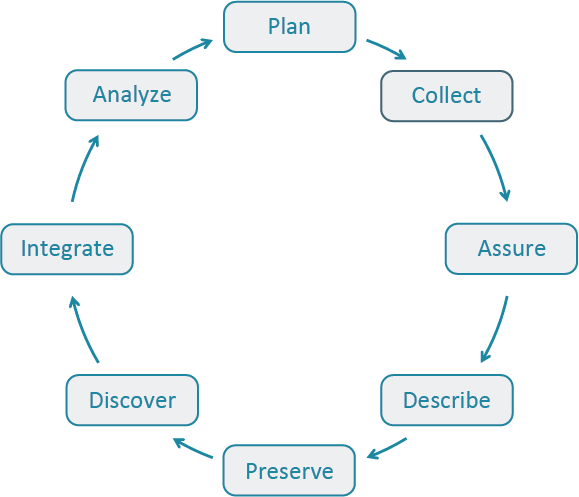
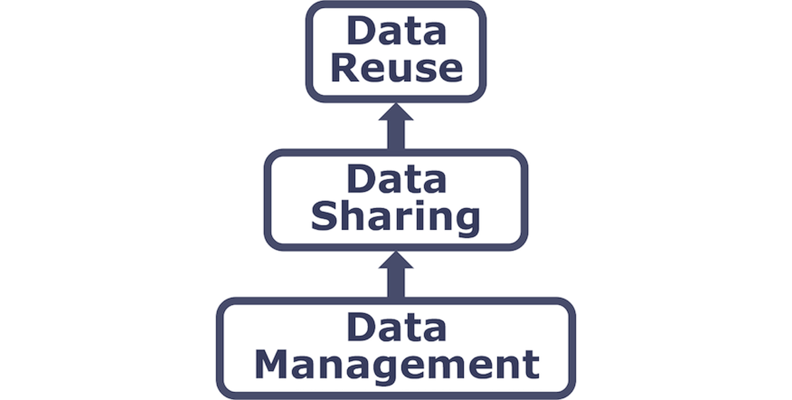

:::{.callout-learning}
After completing this session, you will be able to:

- Explain why managing data from the start of a project is important during and after a synthesis project
- Discuss some best practices for reproducibility
- Identify repositories "known for" a particular type of data
- Explain how to effectively search for data outside of specialized repositories

:::

::: {.callout-note}
## Acknowledgments

The "Finding Data" section in this page was adapted from the Long Term Ecological Research (LTER) Network's course "Synthesis Skills for Early Career Researchers" (SSECR). Those materials can be found at [lter.github.io/ssecr](https://lter.github.io/ssecr/)
:::

## The Big Idea

The ultimate goal of this lesson is to provide an overview of a reproducible open science framework for your research, when either you are accessing published data (data user) to -- for example use it for synthesis or you want to publish your own data (data author). To achieve this, we are going to talk about the following topics.

-   The Data Life Cycle
-   The importance of data management
-   Metadata best practices
-   Data preservation

We will discuss how these topics relate to each other and why they are the building block for you to use others' data and for others to access, interpret, and use your data in the future.

## The Data Life Cycle

The Data Life Cycle gives you an overview of meaningful steps in a research project. This step-by-step breakdown facilitates successful management and preservation of data throughout a project. Some research activities might use only part of the life cycle. For example, a meta-analysis might focus on the Discover, Integrate, and Analyze steps, while a project focused on primary data collection and analysis might bypass the Discover and Integrate steps.

[{fig-alt="Data Life Cycle graphic with each stage following the next to create a circle." fig-align="center"}](https://dataoneorg.github.io/Education/bestpractices/)

The first step to working with data is identifying where my project is starting in the Data Life Cycle. Using the data life cycle stages, create your own cycle that best fits your project needs.

**A way to use the Data Life Cycle in practice is to:**

-   Think about the end goal, outcomes, and products of your project
-   Think and decide steps in the Data Life Cycle you need to include in your project
-   Review [DataONE's best practices](https://dataoneorg.github.io/Education/bestpractices/) for that step in the cycle and start outlining action items in each of those steps.

DataOne's [Data Management Skillbuilding Hub](https://dataoneorg.github.io/Education/bestpractices/) offers several best practices on how to effectively work with your data throughout all stages of the data life cycle.

No matter how your data life cycle looks like, *Plan* should be at the top of the cycle. It is advisable to initiate your data management planning at the beginning of your research process before any data has been collected or discovered. The following section will discuss more in-depth data management and how to plan accordingly

## Finding Data

### Useful Data Repositories

There are _a lot_ of specialized data repositories out there. These organizations are either primarily dedicated to storing and managing data or those operations constitute a substantive proportion of their efforts. In synthesis work, you may already have some datasets in-hand at the outset but it likely that **you will need to find more data to test your hypotheses**. Data repositories are a great way of finding/accessing data that are relevant to your questions.

You'll become familiar with many of these when you need a particular type of data and go searching for it but to help speed you along, see the list below for a non-exhaustive set of some that have proved useful to other synthesis projects in the past. They are in alphabetical order. If the " Package" column contains the GitHub logo () then the package is available on GitHub but is not available on CRAN (or not available at time of writing).

| **Name** | **Description** |  **Package** |
|:---:|:---|:---:|
| [AmeriFlux](https://ameriflux.lbl.gov/data/data-policy/) | Provides data on carbon, water, and energy fluxes in ecosystems across the Americas, aiding in climate change and carbon cycle research. | [`amerifluxr`](https://cran.r-project.org/web/packages/amerifluxr/index.html) |
| [DataONE](https://www.dataone.org/) | Aggregates environmental and ecological data from global sources, focusing on biodiversity, climate, and ecosystem research. | [`dataone`](https://cran.r-project.org/web/packages/dataone/index.html) |
| [EDI](https://edirepository.org/) | Contains a wide range of ecological and environmental datasets, including long-term observational data, experimental results, and field studies from diverse ecosystems. | [`EDIutils`](https://cran.r-project.org/web/packages/EDIutils/index.html) |
| [EES-DIVE](https://ess-dive.lbl.gov/) | The Environmental System Science Data Infrastructure for a Virtual Ecosystem (ESS-DIVE) includes a variety of observational, experimental, modeling and other data products from a wide range of ecological and urban systems. | -- |
| [GBIF](https://www.gbif.org/) | The Global Biodiversity Information Facility (GBIF) aggregates global species occurrence data and biodiversity records, supporting research in species distribution and conservation. | [`rgbif`](https://cran.r-project.org/web/packages/rgbif/index.html) |
| [Google Earth Engine](https://earthengine.google.com/) | Google Earth Engine is a cloud-based geospatial analysis platform that provides access to vast amounts of satellite imagery and environmental data for monitoring and understanding changes in the Earth's surface. |  [`rgee`](https://github.com/r-spatial/rgee) |
| [Microsoft Planetary Computer](https://planetarycomputer.microsoft.com/) | The Microsoft Planetary Computer is a cloud-based platform that combines global environmental datasets with advanced analytical tools to support sustainability and ecological research. |  [`rstac`](https://github.com/brazil-data-cube/rstac) |
| [NASA](https://data.nasa.gov/) | Provides data on earth science, space exploration, and climate, including satellite imagery and observational data for both terrestrial and extraterrestrial studies. Nice GUI-based data download via [AppEEARS](https://appeears.earthdatacloud.nasa.gov/). | [`nasadata`](https://cran.r-project.org/web/packages/nasadata/index.html) |
| [NCBI](https://www.ncbi.nlm.nih.gov/) | Hosts genomic and biological data, including DNA, RNA, and protein sequences, supporting genomics and molecular biology research. | [`rentrez`](https://cran.r-project.org/web/packages/rentrez/index.html) |
| [NEON](https://data.neonscience.org/) | Provides ecological data from U.S. field sites, covering biodiversity, ecosystems, and environmental changes, supporting large-scale ecological research. | [`neonUtilities`](https://cran.r-project.org/web/packages/neonUtilities/index.html) |
| [NOAA](https://data.noaa.gov/onestop/) | Offers meteorological, oceanographic, and climate data, essential for understanding atmospheric conditions, marine environments, and long-term climate trends. |  [`EpiNOAA-R`](https://github.com/NOAA-Big-Data-Program/EpiNOAA-R) |
| [Open Traits Network](https://opentraits.org/datasets.html) | While not a repository _per se_, the Open Traits Network has compiled an extensive lists of repositories for trait data. Check out their repository inventory for trait data | -- |
| [USGS](https://www.usgs.gov/products/data/all-data) | Hosts data on geology, hydrology, biology, and geography, including topographical maps and natural resource assessments. | [`dataRetrieval`](https://cran.r-project.org/web/packages/dataRetrieval/index.html) |

### General Data Searches

If you don't find what you're looking for in a particular data repository (or want to look for data not included in one of those platforms), you might want to consider a broader search. For instance, [Google](https://www.google.com) is a surprisingly good resource for finding data and--for those familiar with Google Scholar for peer reviewed literature-specific Googling--there is a dataset-specific variant of Google called [Google Dataset Search](https://datasetsearch.research.google.com/).

### Search Operators

Virtually all search engines support "operators" to create more effective queries (i.e., search parameters). If you don't use operators, most systems will just return results that have any of the words in your search which is non-ideal, especially when you're looking for very specific criteria in candidate datasets.

See the tabs below for some useful operators that might help narrow your dataset search even when using more general platforms.

:::{.panel-tabset}
#### Quotes

Use quotation marks (`""`) to **search for an exact phrase**. This is particularly useful when you need specific data points or exact wording.

Example: `"reef biodiversity"`

#### Wildcard

Use an asterisk (`*`) to **search using a placeholder for any word or phrase in the query**. This is useful for finding variations of a term.

Example: `Pinus * data`

#### Plus

Use a plus sign (`+`) to **search using more than one query *at the same time***. This is useful when you need combinations of criteria to be met.

Example: `bat + cactus`

#### OR

Use the 'or' operator (`OR`) operator to **search for either one term *or* another**. It broadens your search to include multiple terms.

Example: `"prairie pollinator" OR "grassland pollinator"`

#### Minus

Use a minus sign (`-`; a.k.a. "hyphen") to **exclude certain words from your search**. Useful to filter out irrelevant results.

Example: `marine biodiversity data -fishery`

#### Site

Use the site operator (`site:`) to **search within a specific website or domain**. This is helpful when you're looking for data from a particular source.

Example: `site:.gov bird data`

#### File Type

Use the file type operator (`filetype:`) to **search for data with a specific file extension**. Useful to make sure the data you find is already in a format you can interact with.

Example: `filetype:tif precipitation data`

#### In Title

Use the 'in title' operator (`intitle:`) to **search for pages that have a specific word in the title**. This can narrow down your results to more relevant pages.

Example: `intitle:"lithology"`

#### In URL

Use the 'in URL' operator (`inurl:`) to **search for pages that have a specific word in the URL**. This can help locate data repositories or specific datasets.

Example: `inurl:data soil chemistry`
:::

## Managing Your Data

Successfully managing your data throughout a research project helps ensures its preservation for future use.

### Why Manage Your Data?

:::{.panel-tabset}
### Personal Benefits

-   Keep yourself organized -- be able to find your files (data inputs, analytic scripts, outputs at various stages of the analytic process, etc.)
-   Track your science processes for reproducibility -- be able to match up your outputs with exact inputs and transformations that produced them
-   Better control versions of data -- easily identify versions that can be periodically purged
-   Quality control your data more efficiently
-   To avoid data loss (e.g. making backups)
-   Format your data for re-use (by yourself or others)
-   Be prepared: Document your data for your own recollection, accountability, and re-use (by yourself or others)
-   Gain credibility and recognition for your science efforts through data sharing!

### Advancement of Science

-   Data is a valuable asset -- it is expensive and time consuming to collect
-   Maximize the effective use and value of data and information assets
-   Continually improve the quality including: data accuracy, integrity, integration, timeliness of data capture and presentation, relevance, and usefulness
-   Ensure appropriate use of data and information
-   Facilitate data sharing
-   Ensure sustainability and accessibility in long term for re-use in science

:::

### Tools to Manage your Data

A Data Management Plan (DMP) is a document that describes how you will use your data during a research project, as well as what you will do with your data long after the project ends. DMPs are living documents and should be updated as research plans change to ensure new data management practices are captured ([Environmental Data Initiative](https://edirepository.org/resources/data-management-planning)).

A well-thought-out plan means you are more likely to:

- Stay organized
- Work efficiently
- Truly share data
- Engage your team
- Meet funder requirements
    - DMPs are becoming common in the submission process for proposals

A DMP is both a straightforward blueprint for how you manage your data, *and* provides guidelines for your and your team on policies, access, roles, and more. While it is important to plan, it is equally important to recognize that no plan is perfect as change is inevitable. To make your DMP as robust as possible, treat it as a "living document" that you periodically review with your team and adjust as the needs of the project change.

### How to Plan

-   **Plan early:** research shows that over time, information is lost and this is inevitable so it's important to think about long-term plans for your research at the beginning before you're deep in your project. And ultimately, you'll save more time.
-   **Plan in collaboration:** high engagement of your team and other important contributors is not only a benefit to your project, but it also makes your DMP more resilient. When you include diverse expertise and perspectives to the planning stages, you're more likely to overcome obstacles in the future.
-   **Utilize existing resources:** don't reinvent the wheel! There are many great DMP resources out there. Consider the article *Ten Simple Rules for Creating a Good Data Management Plan* [@michener_2015], which has succinct guidelines on what to include in a DMP. Or use an online tool like [DMPTool](https://dmptool.org/){.external target="_blank"}, which provides official DMP templates from funders like NSF, example answers, and allows for collaboration.
-   **Make revising part of the process:** Don't let your DMP collect dust after your initially write it. Make revising the DMP part of your research project and use it as a guide to ensure you're keeping on track.
-   **Include tidy and ethical lenses:** It is important to start thinking through these lenses during the planning process of your DMP, it will make it easier to include and maintain tidy and ethical principles throughout the entire project. We will discuss in depth about tidy data and FAIR principles and we can point you to some useful resources on data ethics though the CARE principles.

## Metadata Best Practices

Within the data life cycle you can be collecting data (creating new data) or integrating data that has all ready been collected. Either way, **metadata** plays plays a major role to successfully spin around the cycle because it enables data reuse long after the original collection.

Imagine that you're writing your metadata for a typical researcher (who might even be you!) 30+ years from now - what will they need to understand what's inside your data files? The goal is to have enough information for the researcher to **understand the data**, **interpret the data**, and then **reuse the data** in another study.

Another way to think about metadata is to answer the following questions with the documentation:

-   What was measured?
-   Who measured it?
-   When was it measured?
-   Where was it measured?
-   How was it measured?
-   How is the data structured?
-   Why was the data collected?
-   Who should get credit for this data (researcher AND funding agency)?
-   How can this data be reused (licensing)?

:::{.panel-tabset}
### Bibliography

The details that will help your data be cited correctly are:

-   **Global identifier** like a digital object identifier (DOI)
-   Descriptive **title** that includes information about the topic, the geographic location, the dates, and if applicable, the scale of the data
-   Descriptive **abstract** that serves as a brief overview off the specific contents and purpose of the data package
-   **Funding information** like the award number and the sponsor
-   **People and organizations** like the creator of the dataset (i.e. who should be cited), the person to **contact** about the dataset (if different than the creator), and the contributors to the dataset

### Findability

The details that will help your data be discovered correctly are:

-   **Geospatial coverage** of the data, including the field and laboratory sampling locations, place names and precise coordinates
-   **Temporal coverage** of the data, including when the measurements were made and what time period (ie the calendar time or the geologic time) the measurements apply to
-   **Taxonomic coverage** of the data, including what species were measured and what taxonomy standards and procedures were followed
-   Any other **contextual information** as needed

### Interpretable

The details that will help your data be interpreted correctly are:

-   **Collection methods** for both field and laboratory data the full experimental and project design as well as how the data in the dataset fits into the overall project
-   **Processing methods** for both field and laboratory samples
-   All sample **quality control procedures**
-   **Provenance** information to support your analysis and modelling methods
-   Information about the **hardware and software** used to process your data, including the make, model, and version
-   **Computing quality control** procedures like testing or code review

### Data Structure

-   **Everything needs a description**: the data model, the data objects (like tables, images, matrices, spatial layers, etc), and the variables all need to be described so that there is no room for misinterpretation.
-   **Variable information** includes the definition of a variable, a standardized unit of measurement, definitions of any coded values (i.e. 0 = not collected), and any missing values (i.e. 999 = NA).

Not only is this information helpful to you and any other researcher in the future using your data, but it is also helpful to search engines. The semantics of your dataset are crucial to ensure your data is both discoverable by others and interoperable (that is, reusable).

For example, if you were to search for the character string "carbon dioxide flux" in a data repository, not all relevant results will be shown due to varying vocabulary conventions (i.e., "CO2 flux" instead of "carbon dioxide flux") across disciplines --- only datasets containing the exact words "carbon dioxide flux" are returned. With correct semantic annotation of the variables, your dataset that includes information about carbon dioxide flux but that calls it CO2 flux WOULD be included in that search.

### Attribution

Correctly **assigning a way for your datasets to be cited** and reused is the last piece of a complete metadata document. This section sets the scientific rights and expectations for the future on your data, like:

-   Citation format to be used when giving credit for the data
-   Attribution expectations for the dataset
-   Reuse rights, which describe who may use the data and for what purpose
-   Redistribution rights, which describe who may copy and redistribute the metadata and the data
-   Legal terms and conditions like how the data are licensed for reuse.

### Metadata Standards

So, **how does a computer organize all this information?** There are a number of metadata standards that make your metadata machine readable and therefore easier for data curators to publish your data.

-   [Ecological Metadata Language (EML)](https://eml.ecoinformatics.org/)
-   [Geospatial Metadata Standards (ISO 19115 and ISO 19139)](https://www.fgdc.gov/metadata/iso-standards)
    -   See [NOAA's ISO Workbook](http://www.ncei.noaa.gov/sites/default/files/2020-04/ISO%2019115-2%20Workbook_Part%20II%20Extentions%20for%20imagery%20and%20Gridded%20Data.pdf)
-   [Biological Data Profile (BDP)](chrome-extension://efaidnbmnnnibpcajpcglclefindmkaj/https://www.fgdc.gov/standards/projects/FGDC-standards-projects/metadata/biometadata/biodatap.pdf)
-   [Dublin Core](https://www.dublincore.org/)
-   [Darwin Core](https://dwc.tdwg.org/)
-   [PREservation Metadata: Implementation Strategies (PREMIS)](https://www.loc.gov/standards/premis/)
-   [Metadata Encoding Transmission Standard (METS)](https://www.loc.gov/standards/mets/)

*Note this is not an exhaustive list.*

### Data Identifiers

Many journals require a DOI (a digital object identifier) be assigned to the published data before the paper can be accepted for publication. The reason for that is so that the data can easily be found and easily linked to.

Some data repositories assign a DOI for each dataset you publish on their repository. But, if you need to update the datasets, check the policy of the data repository. Some repositories assign a new DOI after you update the dataset. If this is the case, researchers should cite the exact version of the dataset that they used in their analysis, even if there is a newer version of the dataset available.

### Data Citation

Researchers should get in the habit of citing the data that they use (even if it's their own data!) in each publication that uses that data.

:::

## Data Sharing & Preservation

{fig-alt="Small diagram of three boxes connected by two, one-way arrows. The boxes (from first in the path to last) are labeled 'Data Management', 'Data Sharing', and 'Data Reuse', respectively" fig-align="center" width="40%"}

### Data Packages

**We define a data package as a scientifically useful collection of data and metadata that a researcher wants to preserve.**

Sometimes a data package represents all of the data from a particular experiment, while at other times it might be all of the data from a grant, or on a topic, or associated with a paper. Whatever the extent, we define a data package as having one or more data files, software files, and other scientific products such as graphs and images, all tied together with a descriptive metadata document.

Many data repositories assign a unique identifier to every version of every data file, similarly to how it works with source code commits in GitHub. Those identifiers usually take one of two forms. A DOI identifier, often assigned to the metadata and becomes a publicly citable identifier for the package. Each of the other files gets a global identifier, often a UUID that is globally unique. This allows to identify a digital entity within a data package.

In the graphic to the side, the package can be cited with the DOI `doi:10.5063/F1Z1899CZ`,and each of the individual files have their own identifiers as well.

{fig-alt="Diagram of a data package where a single metadata box is connected to a stacked set of boxes labeled 'data granule 1', both of these are connected to boxes labeled 'software' and 'figures'" fig-align="center"}

## Practice Evaluating a Data Package

Explore data packages published on EDI assess the quality of their metadata. Imagine you are planning on using this data for a synthesis project.

::::{.callout-exercise}
### Exercise - Evaluate Data on EDI

:::{.panel-tabset}
### Separate Into Groups

Break into four groups and use the following data packages:

- **Group A:** [SBC LTER: Reef: Abundance, size and fishing effort for California Spiny Lobster (Panulirus interruptus), ongoing since 2012](https://portal.edirepository.org/nis/mapbrowse?packageid=knb-lter-sbc.77.8)
- **Group B:** [Physiological stress of American pika (Ochotona princeps) and associated habitat characteristics for Niwot Ridge, 2018 - 2019](https://portal.edirepository.org/nis/mapbrowse?packageid=knb-lter-nwt.268.1)
- **Group C:** [Ecological and social interactions in urban parks: bird surveys in local parks in the central Arizona-Phoenix metropolitan area](https://portal.edirepository.org/nis/mapbrowse?scope=knb-lter-cap&identifier=256&revision=10)
- **Group D:** [Interagency Ecological Program: Fish catch and water quality data from the Sacramento River floodplain and tidal slough, collected by the Yolo Bypass Fish Monitoring Program, 1998-2021.](https://portal.edirepository.org/nis/mapbrowse?scope=edi&identifier=233&revision=3)

### Evaluate a Package

Your group will evaluate a data package for its: (1) metadata quality, and (2) data documentation quality for reusability.

1.  Open our [Data Package Assessment Rubric](https://docs.google.com/document/d/1PQpw9ohOMY7K1yBWaknMHV0dGEm0GnZ9pCB8_i2JPoU/edit?usp=sharing) (Note: Evaluate only the Metadata Documentation and Quality section), make copy and:
2. **Investigate the metadata in the provided data**
    - Does the metadata meet the standards we talked about? How so?
    - If not, how would you improve the metadata based on the standards we talked about?
3. **Investigate the overall data documentation in the data package**
    - Is the documentation sufficient enough for reusing the data? Why or why not?
    - If not, how would you improve the data documentation? What's missing?

### Discussion

Elect someone to share back to the group the following:

- How easy or challenging was it to find the metadata and other data documentation you were evaluating? Why or why not?
- What documentation stood out to you? What did you like or not like about it?
- Do you feel like you understand the research project enough to use the data yourself (aka reproducibility?
:::
::::
