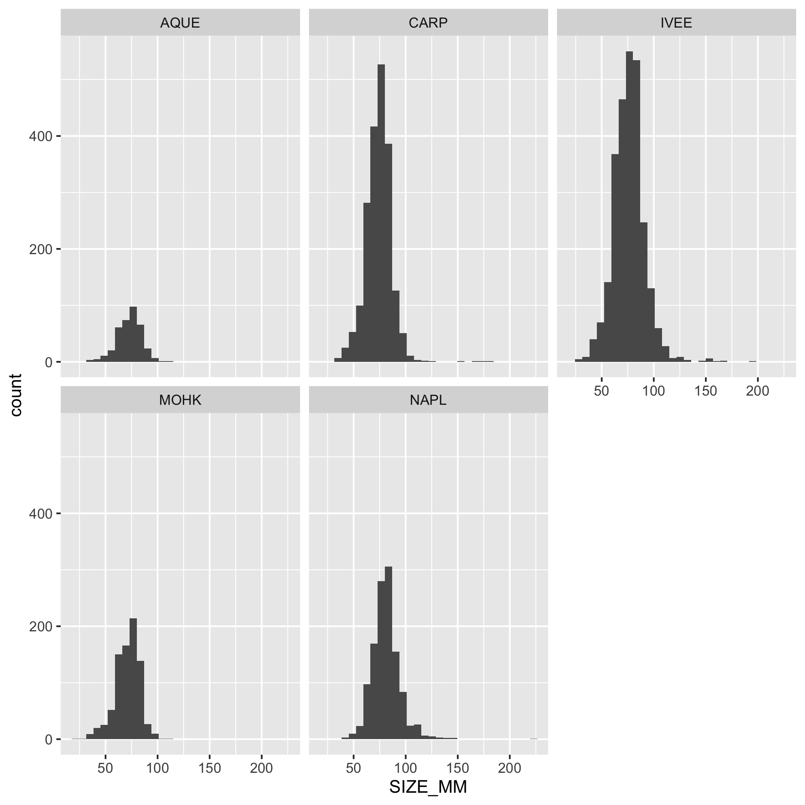
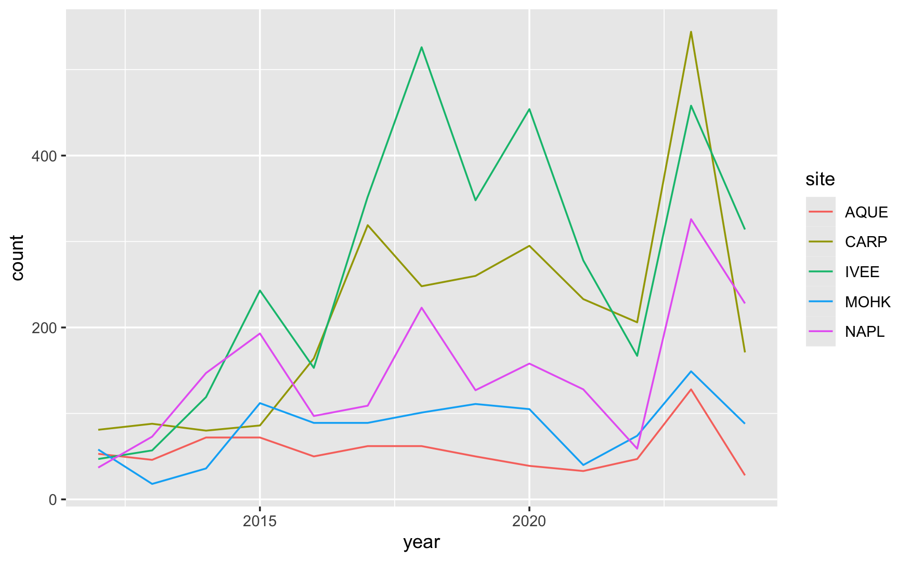
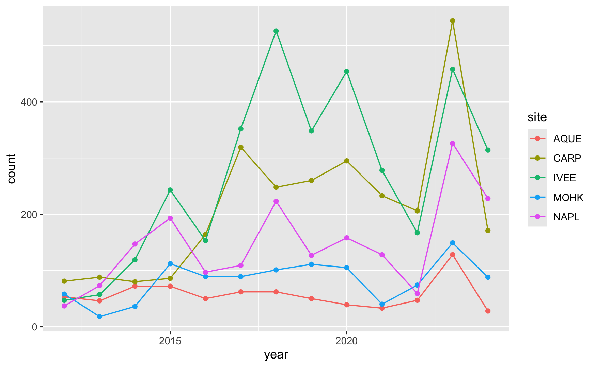
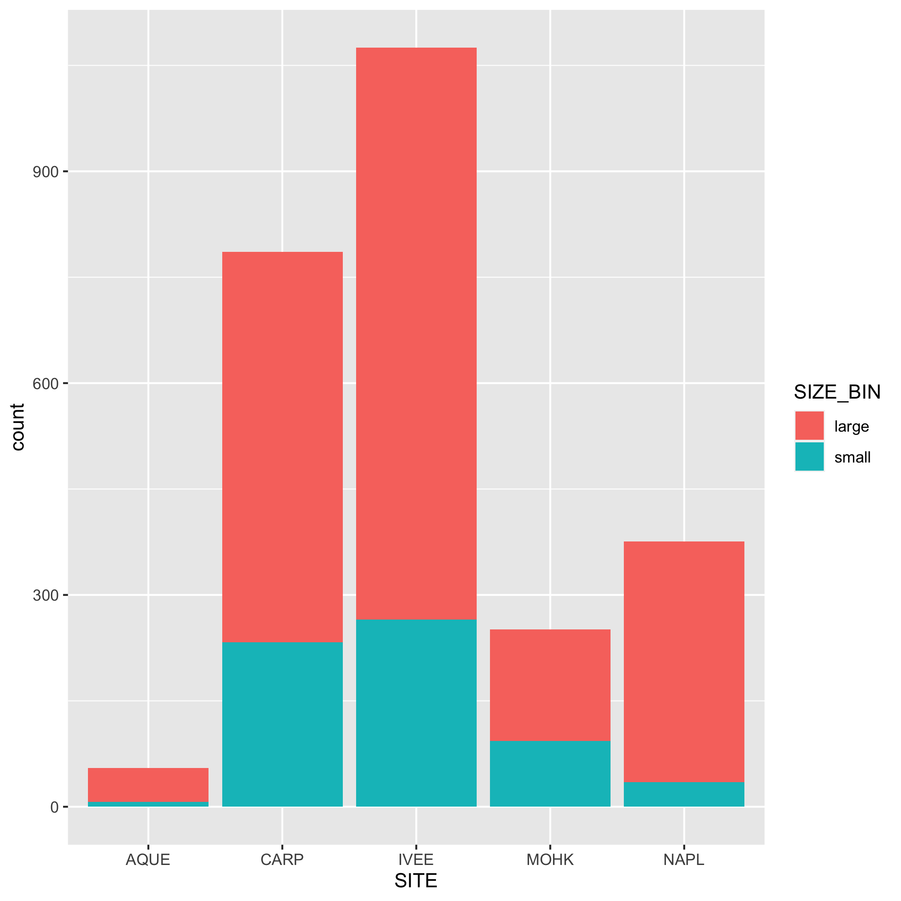
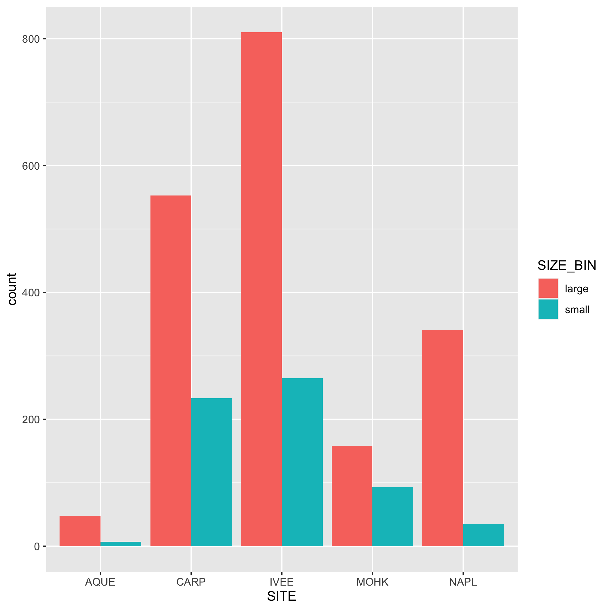
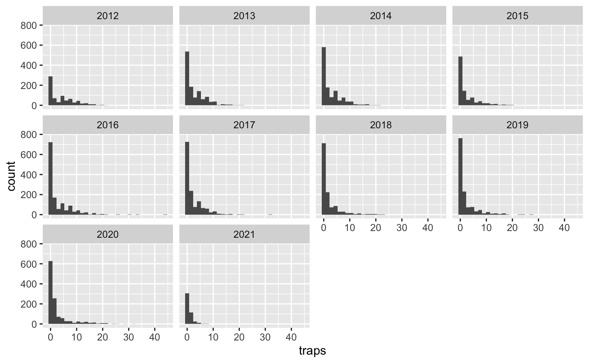
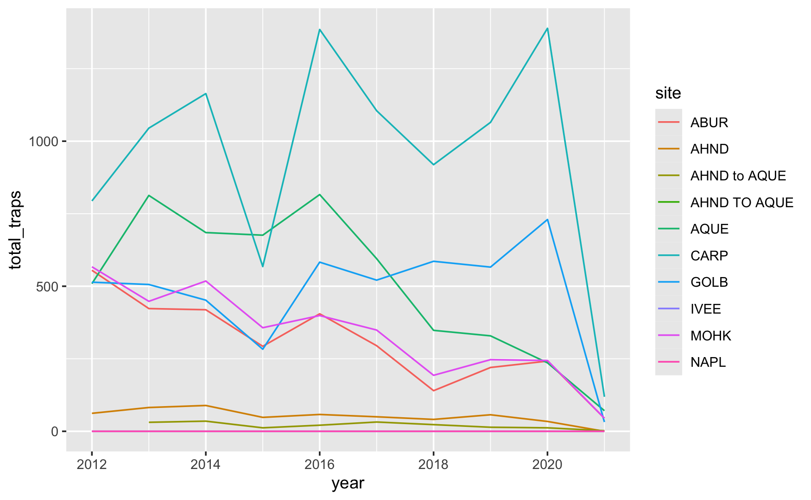
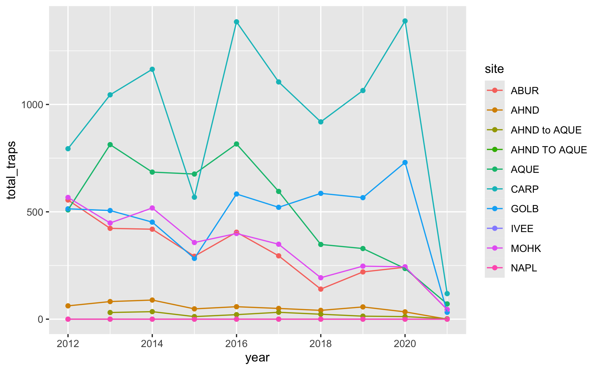
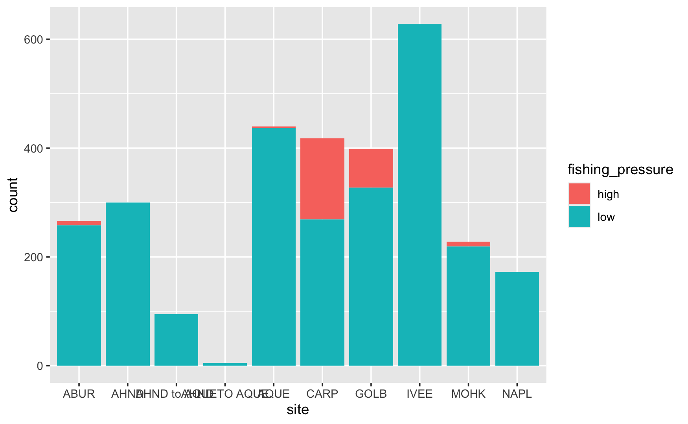
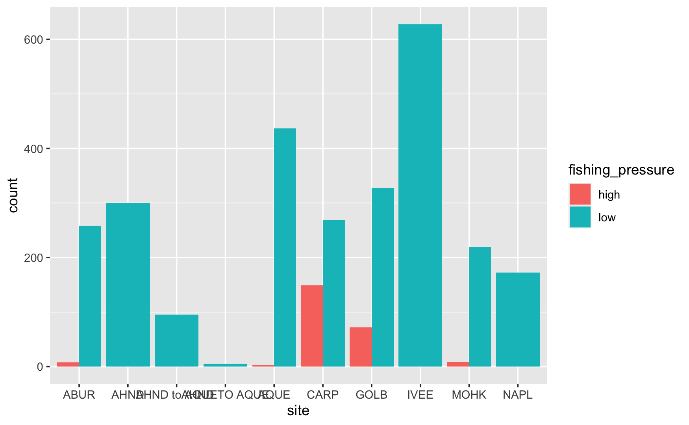

<!-- recommended prerequisites: 
* github_introduction
* lecture_tidy_data
* r_tidyverse_clean_wrangle
-->

:::{.callout-learning}

During this practice session, you will be able to:

-   Effectively use common cleaning and wrangling functions
-   Create amd customize plots using common visualization functions in `ggplot`
-   Save and share data visualizations
-   Explain and demonstrate effective "lightweight" code review practices
-   Apply Git and GitHub skills to publish a collaborative report to GitHub Pages
:::

::: {.callout-note}
## Acknowledgments

These exercises are adapted from Allison Horst's EDS 221: Scientific Programming Essentials Course for the Bren School's Master of Environmental Data Science program.
:::

## About the data {.unnumbered}

These exercises will be using data on abundance, size, and trap counts (fishing pressure) of California spiny lobster (*Panulirus interruptus*) and were collected along the mainland coast of the Santa Barbara Channel by Santa Barbara Coastal LTER researchers [@reed_2024].

Your task: Collaborate on an analysis and create a report to publish using GitHub Pages.

## Setup Collaborative Repository

For this collaborative report, participants will be working in pairs.  Each partner will focus on a different portion of the analysis, and the collaboration will bring the two sub-analyses together into a single collaborative report.

### Create a New Repository With a Partner

1. Select one partner to be the [**Owner**]{style="color: orange;"}; the other is the [**Collaborator**]{style="color: purple;"}
2. The [**Owner**]{style="color: orange;"} creates a repository on GitHub titled with both your names (e.g., If Casey and Camila were partners, and Casey is the [**Owner**]{style="color: orange;"}, he would create a repo called `casey_camila`).  When creating the repository:
    * add a brief description (e.g., "R Practice Session: Collaborating on, Wrangling & Visualizing Data")
    * keep the repo Public
    * initialize the repo with a `README` file and an R `.gitignore` template.
3. The [**Owner**]{style="color: orange;"} invites the [**Collaborator**]{style="color: purple;"} to the repo on GitHub 
    * Settings --> Collaborators --> Manage Access --> Invite a collaborator)
    * [**Collaborator**]{style="color: purple;"} accepts invitation
4. Both the [**Collaborator**]{style="color: purple;"} and the [**Owner**]{style="color: orange;"} clone the repo into their local computer (e.g., through RStudio, Positron, or Terminal)

:::{.callout-warning}
Note, the repository was created as "public" so anyone can see and clone the repo, and make local changes, even without being added as a collaborator.  However, non-collaborators will not have permissions to push changes back to the repository.
:::

### Create Files and Add Data

The [**Collaborator**]{style="color: purple;"} will set up new files for the analysis, while the [**Owner**]{style="color: orange;"} will download data and add it to the repository.  Follow the instructions on the tab for your role:

:::{.panel-tabset}
## [**Collaborator**]{style="color: purple;"}

[**Collaborator**]{style="color: purple;"} creates new files for exercise

1. The [**Collaborator**]{style="color: purple;"} creates the following directory (folder):
    * `analysis` 
2. After creating the directories, create the following Quarto Documents and store them in the listed folders:
    a. Title: "Owner Analysis", save as: `analysis/owner_analysis.qmd`
    b. Title: "Collaborator Analysis", save as: `analysis/collaborator_analysis.qmd`
    c. Title: "Lobster Report" and save as: `analysis/lobster_report.qmd`
3.  After creating the files, the [**Collaborator**]{style="color: purple;"} will **stage (add)** the changes, **commit**, and write a commit message.  Then **Sync** (Positron) or **Pull** and **Push** (RStudio or Terminal) the files to the remote repository (on GitHub)
4.  The [**Owner**]{style="color: orange;"} **Sync**s or **Pull**s the changes and Quarto Documents into their local repository (their workspace)

## [**Owner**]{style="color: orange;"}

[**Owner**]{style="color: orange;"} downloads data from the EDI Data Portal [SBC LTER: Reef: Abundance, size and fishing effort for California Spiny Lobster (Panulirus interruptus), ongoing since 2012](https://portal.edirepository.org/nis/mapbrowse?scope=knb-lter-sbc&identifier=77&revision=10).
    a.  Create two new directories one called `data` and one called `figs`
        i. *Note: Git does not track empty directories, so you won't see `figs` when you push to GitHub*
    b.  Download the following data and upload them to the `data` folder:
        i.  Time-series of lobster abundance and size
        ii. Time-series of lobster trap buoy counts
    c.  After creating the `data` folder and adding the data, the [**Owner**]{style="color: orange;"} will **stage (add)** the changes, **commit**, and write a commit message.  Then **Sync** (Positron) or **Pull** and **Push** (RStudio or Terminal) the files to the remote repository (on GitHub)
    c.  The [**Collaborator**]{style="color: purple;"} **Sync**s or **Pull**s the changes and data into their local repository (their workspace)
:::

## Explore, clean and wrangle data

For this portion of the exercise, the 
- [**Owner**]{style="color: orange;"} will be working with the **lobster abundance and size data**
- [**Collaborator**]{style="color: purple;"} will be working with the **lobster trap buoy counts data**

In these sections you will be working independently since you're working with different data frames, but you're welcome to check in with each other.

::: panel-tabset
## [**Owner**]{style="color: orange;"}

### Setup{.unnumbered}

1.  Open the Quarto Document `owner_analysis.qmd`
    a.  Check the `YAML` and add your name to the `author` field
    b.  Create a new section with a level 2 header and title it "Exercise: Explore, Clean, and Wrangle Data"
2.  Load the following packages in a code chunk (optional: give the chunk a meaningful name like "setup" or "load packages") at the top of your Quarto Document:

```r
library(readr)
library(dplyr)
library(ggplot2)
library(tidyr)
```
<!-- NOTE: since no code chunks are run to render, make them "dumb" but
     display with r syntax coloring -->

3.  Read in the data and store the data frame as `lobster_abundance`.  Here we also use the `clean_names()` function from the helpful `janitor` package.  This converts all variable names to `snake_case` by default.  Having a consistent naming convention helps with collaboration!

```r
lobster_abundance <- read_csv("data/Lobster_Abundance_All_Years_20240411.csv") %>%
    janitor::clean_names()
```

4. Look at your data. Take a minute to explore what your data structure looks like, what data types are in the data frame, or use a function to get a high-level summary of the data you're working with.
5. Use the Git workflow: **Stage (add) -> Commit -> Pull -> Push**
    - **Note:** You also want to `Pull` every time you open a project, to make sure you retrieve any changes your collaborators have made.
    
:::{.callout-tip}
### Using `namespace::function()` syntax

Because we used `namespace::function()` syntax to call `janitor::clean_names()`, we can access the function without explicitly loading it in our previous chunk! (i.e., no `library(janitor)` is necessary)
:::

### Modify Quarto document to wrangle data{.unnumbered}

The following exercises challenge you to apply functions from `dplyr` and `tidyr` (in the `tidyverse` metapackage) to clean data, create subsets, 

::: {.callout-exercise}
## Convert missing values using `mutate()` and `na_if()`

The variable `size_mm` uses -99999 as the code for missing values (see metadata or use `unique()`). This has the potential to cause conflicts with our analyses, so let's convert -99999 to an `NA` value. Do this using `mutate()` and `na_if()` or `ifelse()`. Look up the help page to see how to use `na_if()` and `ifelse()`. Check your output data using `unique()`.

:::: {.callout-answer}

```r
lobster_abundance <- lobster_abundance %>% 
    mutate(size_mm = na_if(size_mm, -99999))

lobster_abundance <- lobster_abundance %>% 
    mutate(size_mm = ifelse(size_mm == -99999, NA, size_mm))
```

NOTE: If you know the `NA` values ahead of time, you can specify them when you read the data in!

```
lobster_abundance <- read_csv("data/Lobster_Abundance_All_Years_20240411.csv", 
                              na = "-99999")
```

::::
:::


::: {.callout-exercise}
## Subset data using `filter()` to exclude observations

Create and store a subset that does NOT include observations from Naples Reef (`NAPL`). Check your output data frame to ensure that `NAPL` is NOT in the data frame.

::::{.callout-answer}

```r
not_napl <- lobster_abundance %>% 
    filter(site != "NAPL")
```

::::
:::

::: {.callout-exercise}
## Subset data using `filter()` to meet multiple conditions

Create and store a subset with lobsters at Arroyo Quemado (`AQUE`) AND with a carapace length greater than 70 mm. Check your output.

::::{.callout-answer}

```r
aque_70mm <- lobster_abundance %>% 
    filter(site == "AQUE" & size_mm >= 70)
```

::::
:::

::: {.callout-exercise}
## Calculate summary statistics using `group_by() %>% summarize()` 

Find the maximum carapace length using `max()` and group by `site` and `month`. Think about how you want to treat the NA values in `size_mm` (Hint: check the arguments in `max()`). Check your output.

::::{.callout-answer}

```r
max_lobster <- lobster_abundance %>% 
  group_by(site, month) %>% 
  summarize(max_length = max(size_mm, na.rm = TRUE),
            .groups = 'drop')
```
NOTE: `.groups = "drop"` is an argument in `summarize()` that tells R to ungroup the data frame after summarizing (and suppresses an annoying warning!). If you don't include this argument, the resulting data frame wmay still contain groups, which can lead to unexpected results in subsequent operations.  You can also use `group_by() %>% summarize() %>% ungroup()` to accomplish the same basic idea.
::::
:::


::: callout-important
## Save your work and don't forget the Git and GitHub workflow!
After you've completed the exercises or reached a significant stopping point, use the workflow: **Stage (add) -> Commit -> Pull -> Push**
:::


## [**Collaborator**]{style="color: purple;"}
<!--new tab -->

### Setup{.unnumbered}


1.  Open the Quarto Document `collaborator_analysis.qmd`
    a. Check the `YAML` and add your name to the `author` field
    b. Create a new section with a level 2 header and title it "Exercise: Explore, Clean, and Wrangle Data"
2.  Load the following packages in a code chunk (optional: name it something meaningful, like "setup" or "load packages") at the top of your Quarto Document.

```r
library(readr)
library(dplyr)
library(ggplot2)
library(tidyr)
```

3.  Read in the data and store the data frame as `lobster_traps`. Here we also use the `clean_names()` function from the helpful `janitor` package.  This converts all variable names to `snake_case` by default.  Having a consistent naming convention helps with collaboration!

```r
lobster_traps <- read_csv("data/Lobster_Trap_Counts_All_Years_20210519.csv")
    janitor::clean_names()
```

4. Look at your data. Take a minute to explore what your data structure looks like, what data types are in the data frame, or use a function to get a high-level summary of the data you're working with.
5. Use the Git workflow: **Stage (add) -> Commit -> Pull -> Push**
    - **Note:** You also want to **Sync/Pull** when you first open a project
    
:::{.callout-tip}
### Using `namespace::function()` syntax

Because we used `namespace::function()` syntax to call `janitor::clean_names()`, we can access the function without explicitly loading it in our previous chunk! (i.e., no `library(janitor)` is necessary)
:::

### Modify Quarto document to wrangle data{.unnumbered}

::: {.callout-exercise}
## Convert missing values using `mutate()` and `na_if()`

The variable `traps` uses -99999 as the code for missing values (see metadata or use `unique()`). This has the potential to cause conflicts with our analyses, so let's convert -99999 to an `NA` value. Do this using `mutate()` and `na_if()` or `ifelse()`. Look up the help page to see how to use `na_if()` and `ifelse()`. Check your output data using `unique()`.

::::{.callout-answer}

```r
lobster_traps <- lobster_traps %>% 
    mutate(traps = na_if(traps, -99999))

lobster_traps <- lobster_traps %>% 
    mutate(traps = ifelse(traps == -99999, NA, traps))
```

NOTE: If you know the `NA` values ahead of time, you can specify them when you read the data in!

```
lobster_abundance <- read_csv("data/Lobster_Abundance_All_Years_20220829.csv", 
                              na = "-99999")
```

::::
:::


::: {.callout-exercise}
## Subset data using `filter()` to exclude observations
Create and store a subset that does NOT include observations from Naples Reef (`NAPL`). Check your output data frame to ensure that `NAPL` is NOT in the data frame.

::::{.callout-answer}

```r
not_napl <- lobster_traps %>% 
    filter(site != "NAPL")
```

::::
:::

::: {.callout-exercise}
## Subset data using `filter()` to meet multiple conditions

Create and store a subset with lobsters at Carpinteria Reef (`CARP`) AND number of commercial trap floats is greater than 20. Check your output.

::::{.callout-answer}

```r
carp_20_traps <- lobster_traps %>% 
    filter(site == "CARP" & traps > 20)
```

::::
:::

::: {.callout-exercise}
## Calculate summary statistics using `group_by() %>% summarize()`

Find the maximum number of commercial trap floats using `max()` and group by `site` and `month`. Think about how you want to treat the `NA` values in `traps` (Hint: check the arguments in `max()`). Check your output.

::::{.callout-answer}

```r
max_lobster_traps <- lobster_traps %>% 
    group_by(site, month) %>%
    summarize(max_traps = max(traps, na.rm = TRUE),
              .groups = 'drop')
```
NOTE: `.groups = "drop"` is an argument in `summarize()` that tells R to ungroup the data frame after summarizing (and suppresses an annoying warning!). If you don't include this argument, the resulting data frame wmay still contain groups, which can lead to unexpected results in subsequent operations.  You can also use `group_by() %>% summarize() %>% ungroup()` to accomplish the same basic idea.
::::
:::

::: callout-important
### Save your work and Don't forget the Git and GitHub workflow!
After you've completed the exercises or reached a significant stopping point, use the workflow: **Stage (add) -> Commit -> Pull -> Push**
:::

::: 
<!-- end tabset -->


## Create visually appealing and informative data visualization

**Structure of the data visualization exercises:** 

For this portion of the practice session, we will create basic data visualizations, to be later customized and included in the collaborative report.  

The [**Owner**]{style="color: orange;"} will continue to work with the **lobster abundance and size data**; the [**Collaborator**]{style="color: purple;"} will continue to work with the **lobster trap buoy counts data**.

For each visualization, you may first have you create subsets and summary dataframes to be used in the data visualizations, as well as the basic code to create a visualization. 

::: panel-tabset

## [**Owner**]{style="color: orange;"}

### Setup{.unnumbered}

1. Stay in the Quarto Document `owner_analysis.qmd` and create a new section with a level 2 header and title it "Exercise: Data Visualization"
2. You should already have the `lobster_abundance` data frame in your environment from the previous exercises.  If not, re-run the appropriate code chunk(s) to get the data frame back into your environment.  Hooray reproducibility!

### Visualization Exercises{.unnumbered}

::: {.callout-exercise}
### Create a multi-panel histogram

Create a multi-panel plot of lobster carapace length (`size_mm`) using `ggplot()`, `geom_histogram()`, and `facet_wrap()`. Use the variable `site` in `facet_wrap()`. Use the object `lobster_abundance`.

:::: {.callout-answer}

```r
ggplot(data = lobster_abundance, 
       aes(x = size_mm)) +
    geom_histogram() +
    facet_wrap(~ site)
```

{width="75%" fig-align="center"}

::::
:::

::: {.callout-exercise}
### Create a line graph with multiple groups

Create a line graph of the number of total lobsters observed (y-axis) by year (x-axis) in the study, grouped by `site`.

:::: {.callout-answer}

First, you'll need to create a new dataset subset called `lobsters_summarize`:

- Group the data by `site` AND `year`
- Calculate the total number of lobsters observed

```r
lobsters_summarize <- lobster_abundance %>% 
  group_by(site, year) %>% 
  summarize(count = n(), .groups = 'drop')
```

Next, create a line graph using `ggplot()` and `geom_line()`. Use `geom_point()` to make the data points more distinct, if you prefer.  We also want `site` information on this graph, do this by specifying the variable in the `color` argument. Where should the `color` argument go? Inside or outside of `aes()`? Explain your reasoning.

```r
# line plot
ggplot(data = lobsters_summarize, aes(x = year, y = count)) +
  geom_line(aes(color = site)) 

# line and point plot
ggplot(data = lobsters_summarize, aes(x = year, y = count)) +
  geom_point(aes(color = site)) +
  geom_line(aes(color = site)) 
```

::::: {#lobster-line-plots layout-ncol=2}
{width="50%"} 

{width="50%"}
:::::
::::
:::


::: {.callout-exercise}
### Create a bar plot with multiple groups

Create a bar graph that shows the amount of small and large sized carapace lobsters at each `site` from 2019-2021. **Note:** The small and large divisions are arbitrary here; the carapace size limit for catching and keeping lobster is 3.25 inches or about 82.5 mm.

:::: {.callout-answer}

First, let's create a new dataset subset called `lobster_size`:

- `filter()` for the years 2019, 2020, and 2021
- Add a new column called `size_bin` that contains the values "small" or "large".  A "small" carapace size is <= 70 mm, and a "large" carapace size is greater than 70 mm. Use `mutate()` and `if_else()`. Check your output
- Calculate the number of "small" and "large" sized lobsters using `group()` and `summarize()`. Check your output
- Remove the `NA` values from the subsetted data. Hint: check out `drop_na()`. Check your output

```r
lobster_size <- lobster_abundance %>%
    filter(year %in% c(2019, 2020, 2021)) %>%
    mutate(size_bin = if_else(size_mm <= 70, true = "small", false = "large")) %>%
    group_by(site, size_bin) %>%
    summarize(count = n(), .groups = "drop") %>%
    drop_na()
```

Next, create a bar graph using `ggplot()` and `geom_bar()`. Note that `geom_bar()` automatically creates a stacked bar chart. Try using the argument `position = "dodge"` to make the bars side by side. Pick which bar position you like best.

```r
# bar plot
ggplot(data = lobster_size, aes(x = site, y = n, fill = size_bin)) +
    geom_col()

# dodged bar plot
ggplot(data = lobster_size, aes(x = site, y = n, fill = size_bin)) +
    geom_col(position = "dodge")
```

::::: {#lobster-bar-plots layout-ncol=2}

{width="50%"}

{width="50%"}
:::::

::::
:::


## [**Collaborator**]{style="color: purple;"}

### Setup{.unnumbered}

1. Stay in the Quarto Document `collaborator_analysis.qmd` and create a new section with a level 2 header and title it "Exercise: Data Visualization"
2. You should already have the `lobster_traps` data frame in your environment from the previous exercises.  If not, re-run the appropriate code chunk(s) to get the data frame back into your environment.  Hooray reproducibility!

### Visualization Exercises{.unnumbered}

::: {.callout-exercise}
### Create a multi-panel histogram

Create a multi-panel plot of lobster commercial traps (`traps`) grouped by year, using `ggplot()`, `geom_histogram()`, and `facet_wrap()`. Use the variable `year` in `facet_wrap()`. Use the object `lobster_traps`.

:::: {.callout-answer}

```r
ggplot(data = lobster_traps, aes(x = traps)) +
    geom_histogram() +
    facet_wrap( ~ year)
```

{width="75%" fig-align="center"}

::::
:::

::: {.callout-exercise}
### Create a line graph with multiple groups

Create a line graph of the number of total lobster commercial traps observed (y-axis) by year (x-axis) in the study, grouped by `site`.

:::: {.callout-answer}

First, you'll need to create a new dataset subset called `lobsters_traps_summarize`:

- Group the data by `site` AND `year`
- Calculate the total number of lobster commercial traps observed using `sum()`. Look up `sum()` if you need to. Call the new column `total_traps`. Don't forget about `NAs` here!

```r
lobsters_traps_summarize <- lobster_traps %>% 
  group_by(site, year) %>% 
  summarize(total_traps = sum(traps, na.rm = TRUE), 
            .groups = "drop")
```

Next, create a line graph using `ggplot()` and `geom_line()`. Use `geom_point()` to make the data points more distinct, but ultimately up to you if you want to use it or not. We also want `site` information on this graph, do this by specifying the variable in the `color` argument. Where should the `color` argument go? Inside or outside of `aes()`? Why or why not?


```r
# line plot
ggplot(data = lobsters_traps_summarize, aes(x = year, y = total_traps)) +
    geom_line(aes(color = site))

# line and point plot
ggplot(data = lobsters_traps_summarize, aes(x = year, y = total_traps)) +
    geom_point(aes(color = site)) +
    geom_line(aes(color = site))
```

::::: {#lobster-traps-line-plots layout-ncol=2}
{width="50%"} 

{width="50%"}
:::::

::::
:::


::: {.callout-exercise}
### Create a bar graph with multiple groups

Create a bar graph that shows the amount of high and low fishing pressure of lobster commercial traps at each `site` from 2019-2021.
**Note:** The high and low fishing pressure metrics are completely made up and are not based on any known facts.

:::: {.callout-answer}

First, you'll need to create a new dataset subset called `lobster_traps_fishing_pressure`:

- `filter()` for the years 2019, 2020, and 2021
- Add a new column called `fishing_pressure` that contains the values "high" or "low". A "high" fishing pressure has exactly or more than 8 traps, and a "low" fishing pressure has less than 8 traps. Use `mutate()` and `if_else()`. Check your output
- Calculate the number of "high" and "low" observations using `group()` and `summarize()`. Check your output 
- Remove the `NA` values from the subsetted data. Hint: check out `drop_na()`. Check your output

```r
lobster_traps_fishing_pressure <- lobster_traps %>% 
    filter(year %in% c(2019, 2020, 2021)) %>%
    mutate(fishing_pressure = if_else(traps >= 8, true = "high", false = "low")) %>%
    group_by(site, fishing_pressure) %>%
    summarize(count = n(), .groups = "drop") %>%
    drop_na()
```

Next, create a bar graph using `ggplot()` and `geom_bar()`. Note that `geom_bar()` automatically creates a stacked bar chart. Try using the argument `position = "dodge"` to make the bars side by side. Pick which bar position you like best.

```r
# bar plot
ggplot(data = lobster_traps_fishing_pressure, aes(x = site, y = count, fill = fishing_pressure)) +
    geom_col()

# dodged bar plot
ggplot(data = lobster_traps_fishing_pressure, aes(x = site, y = count, fill = fishing_pressure)) +
    geom_col(position = "dodge")
```

::::: {#lobster-bar-plots layout-ncol=2}

{width="50%"} 

{width="50%"}
:::::

::::
:::

:::
<!--end tabset-->

::: callout-important
### Save your work and Don't forget the Git and GitHub workflow!
After you've completed the exercises or reached a significant stopping point, use the workflow: **Stage (add) -> Commit -> Pull -> Push**
:::


## Customize your Visualizations

Now that you've created some basic data visualizations, let's choose one plot to revisit your code and add styling code to it. For this exercise, only add styling code to the visualization you want to include in the `lobster_report.qmd` (if there's time, feel free to add styling code to another plot).  Explore the two tabs to find ways to customize the way data is displayed on your plot and the aesthetics/theme of the plot.

When you have customized your plot(s), save the final visualization(s) to the `figs` folder before collaborating on the `lobster_report.qmd`.

::: {.panel-tabset}
### Customizing the info

Some `ggplot2` functions grant you control over the information displayed on your plot - labels, axis controls, and geometry arguments.  This is far from a complete list!

- `labs()`: modifying axis, legend and plot labels
- `scale_*_continuous()`: use with continuous variables and update breaks, limits, and labels
- `scale_*_discrete()`: use with discrete variables and update breaks, limits, and labels
- `scales` package: use this within the above scale functions and you can do things like add percents to axes labels
- `geom_()` within a geom function you can modify:
    - `fill`: updates fill colors (e.g. column, density, violin, & boxplot interior fill color)
    - `color`: updates point & border line colors (generally)
    - `shape`: update point style
    - `alpha`: update transparency (0 = transparent, 1 = opaque)
    - `size`: point size or line width
    - `linetype`: update the line type (e.g. "dotted", "dashed", "dotdash", etc.)

:::{.callout-tip}
### `aes()` vs non-`aes()` arguments

* If you specify a variable name inside an `aes()` call (e.g., `geom_line(aes(color = lobster_count))`) maps that variable to an aesthetic (e.g. color, shape, size), and the legend is automatically generated.  
* If you specify a color, shape, or size outside of `aes()` (e.g., `geom_line(color = 'red')`), it will apply that style to all points/geoms and no legend will be generated.
* If you specify a variable name outside of `aes()` (e.g., `geom_line(color = lobster_count)`), R will look for an object with that name in your environment and will likely throw an error if it doesn't find it!

:::

### Customizing the theme

The `ggplot2` package includes some built-in themes (e.g., `theme_minimal()`) as well as many options for fine-tuning specific elements of the plot (e.g., changing the color and linewidth of the grid lines).  Here are a few options and examples:

- `theme_()`: add a complete theme to your plot (e.g., `theme_light()`, `theme_minimal()`, `theme_void()`)
- `theme()`: call specific elements to customize non-data components of a plot.  A few examples:

```r
ggplot(...) +
    geom_xxx(...) +
    theme(axis.title = element_text(color = "blue", size = 14),               # <1>
          axis.title.y = element_text(angle = 45),                            # <2>
          axis.text.x = element_blank(),                                      # <3>
          panel.background = element_rect(fill = "lightblue", color = 'red'), # <4>
          panel.grid.major.y = element_line(color = "red", size = 0.5),       # <5>
          text = element_text(family = "Times New Roman"))                    # <6>
```
1. Change the axis title text color and size for both x and y
2. Change the angle of the y-axis title text (note the hierarchical structure)
3. Remove x-axis text - `element_blank()` will cancel any theme element
4. Change the panel background color and border
5. Change the major grid lines on just the y axis
6. Change the font family for all text in the plot

For a comprehensive list of all theme options, visit this reference: https://ggplot2.tidyverse.org/reference/theme.html

:::

Once you're happy with how your plot looks, assign it to an object, and save it to the `figs` directory using `ggsave()`:

```r
final_plot <- ggplot(...) +
    geom_xxx() + ...
    
ggsave(filename = "figs/final_plot.png", plot = final_plot, width = 6, height = 4)
```


::: callout-important
### Save your work and Don't forget the Git and GitHub workflow!
After you've completed the exercises or reached a significant stopping point, use the workflow: **Stage (add) -> Commit -> Pull -> Push**
:::

## Collaborate on a report and publish using GitHub pages

The final step! Time to work together again. Collaborate with your partner in `lobster_report.qmd` to create a report to publish to GitHub pages.

::: {.callout-note}
### Code Review
As you're working on the `lobster_report.qmd` you will be conducting [two types of code reviews](https://en.wikibooks.org/wiki/Introduction_to_Software_Engineering/Quality/Code_Review#:~:text=Code%20review%20practices%20fall%20into,review%20and%20lightweight%20code%20review): (1) pair programming and (2) lightweight code review.

- **Pair programming** is where two people develop code together at the same workstation. One person is the "driver" and one person is the "navigator". The driver writes the code while the navigator observes the code being typed, points out any immediate quick fixes, and will also Google / troubleshoot if errors occur. Both the [**Owner**]{style="color: orange;"} and the [**Collaborator**]{style="color: purple;"} should experience both roles, so switch halfway through or at a meaningful stopping point.

- A **lightweight code review** is brief and you will be giving feedback on code readability and code logic as you're adding [**Owner**]{style="color: orange;"} and [**Collaborator**]{style="color: purple;"} code from their respective `analysis.qmd`s to the `lobster_report.qmd`. Think of it as a walk through of your the code for the data visualizations you plan to include in the report (this includes the code you wrote to create the subset for the plot and the code to create the plot) and give quick feedback.
:::


Make sure your Quarto Document is well organized and includes the following elements:

-   citation of the data
-   brief summary of the abstract (i.e. 1-2 sentences) from the [EDI Portal](https://portal.edirepository.org/nis/mapbrowse?packageid=knb-lter-sbc.77.8)
-   [**Owner**]{style="color: orange;"} analysis and visualizations (you choose which plots you want to include)
    - Try adding alternative text to your plots (See [Quarto Documentation](https://quarto.org/docs/authoring/figures.html#alt-text))
    - Plots can be added either with the data visualization code or with Markdown syntax (calling a saved image) - it's up to you if you want to include the code or not. 
-   [**Collaborator**]{style="color: purple;"} analysis and visualizations (you choose which plots you want to include)
    - Try adding alternative text to your plots (See [Quarto Documentation](https://quarto.org/docs/authoring/figures.html#alt-text))
    - plots can be added either with the data visualization code or with Markdown syntax (calling a saved image) - it's up to you if you want to include the code or not. 

Finally, publish on GitHub pages (from [**Owner**]{style="color: orange;"}'s repository). Refer back to [Chapter 12](https://learning.nceas.ucsb.edu/2024-10-coreR/session_12.html) for steps on how to publish using GitHub pages.


## Bonus: Add marine protected area (MPA) designation to the data

The sites `IVEE` and `NAPL` are marine protected areas (MPAs). Add this designation to your data set using a new function called `case_when()`. Then create some new plots using this new variable. Does it change how you think about the data? What new plots or analysis can you do with this new variable? 

::: panel-tabset

### Lobster Abundance & Size Data

Use the object `lobster_abundance` and add a new column called `DESIGNATION` that contains "MPA" if the site is `IVEE` or `NAPL`, and "not MPA" for all other values.

```r
lobster_mpa <- lobster_abundance %>% 
    mutate(DESIGNATION = case_when(
    site %in% c("IVEE", "NAPL") ~ "MPA",
    site %in% c("AQUE", "CARP", "MOHK") ~ "not MPA"
  ))
    
```


### Lobster Trap Buoy Counts Data

Use the object `lobster_traps` and add a new column called `designation` that contains "MPA" if the site is `IVEE` or `NAPL`, and "not MPA" for all other values.

```r
lobster_traps_mpa <- lobster_traps %>%
    mutate(designation = case_when(
    site %in% c("IVEE", "NAPL") ~ "MPA",
    site %in% c("AQUE", "CARP", "MOHK") ~ "not MPA"
  ))
```

:::


