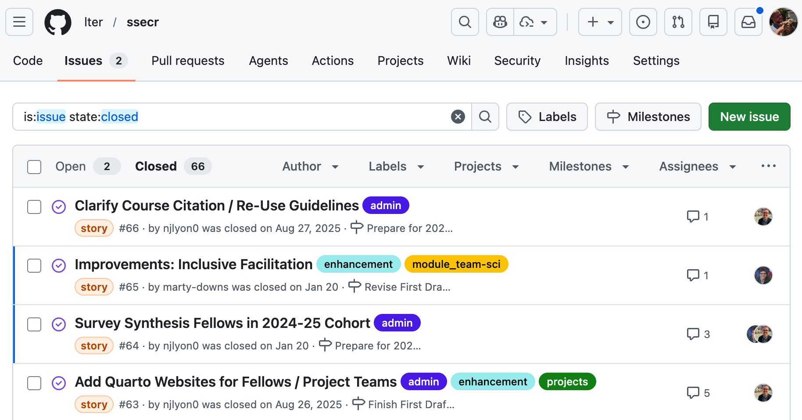
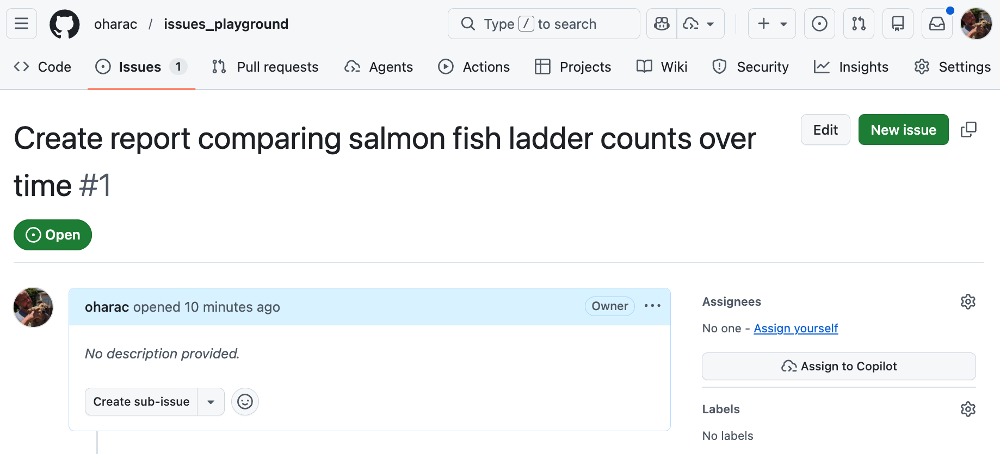
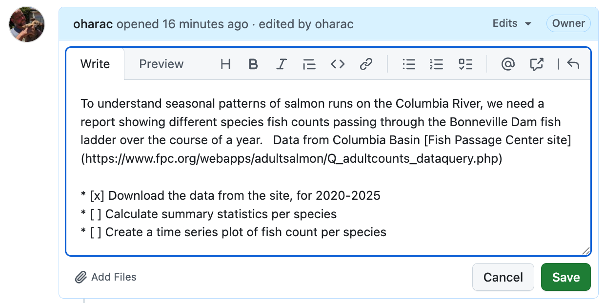
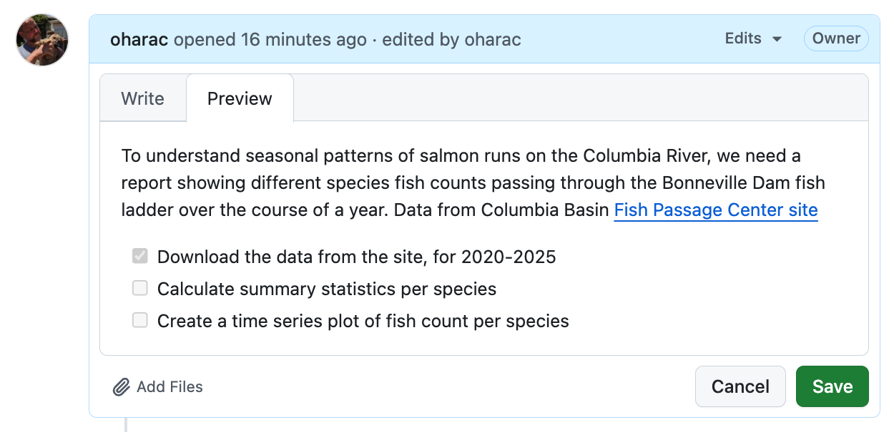
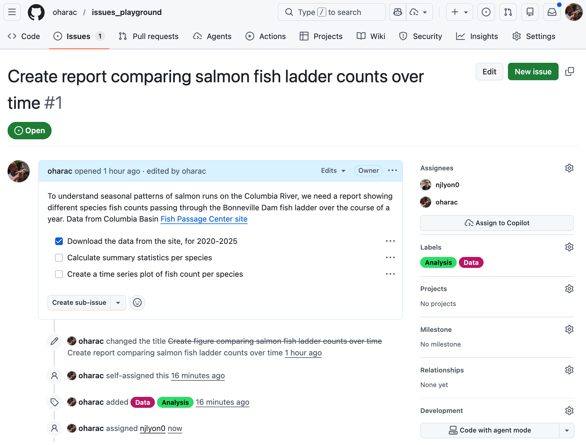
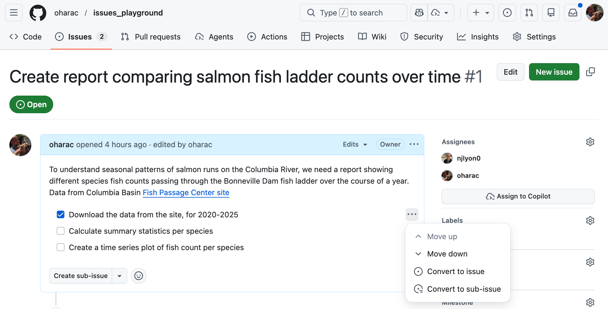
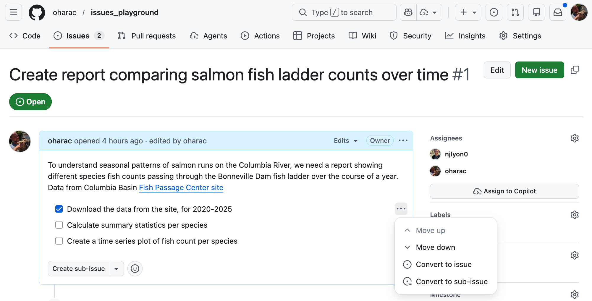
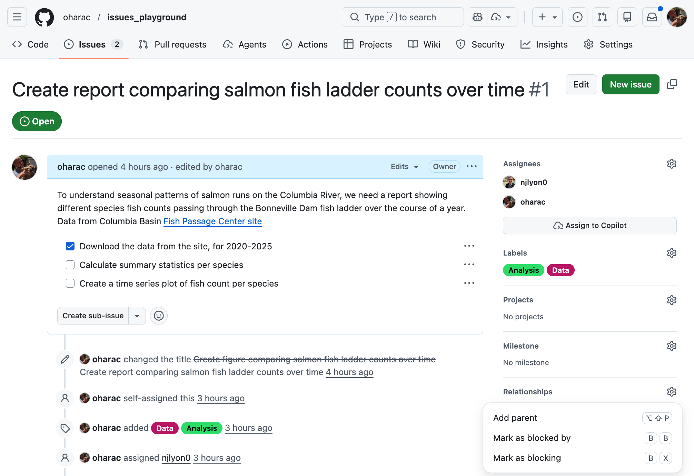

:::{.callout-tip}
## Learning Objectives

After completing this session, you will be able to:

- Utilize GitHub's project management tools to organize and manage projects
- Create issues in GitHub for documentation and to track specific, actionable tasks
- Craft informative READMEs for Git repositories
:::

## Overview

- Several levels of project management tools exist, and GitHub provides a suite of tools to help you manage your projects.
- Issues
- Projects
- READMEs

## GitHub Issues

GitHub Issues are a way of identifying, delegating, and documenting tasks within a single repository, or even across repositories. Think of them as a structured, searchable to-do list that lives right next to your code - complete with a comment thread, assignees, labels, and a permanent record even after a task is finished.

They can also serve as a digital lab notebook: a place to brainstorm, preserve important links, or distribute supplementary material across a team.

An additional use (common in open-source projects) is letting people *outside* your team flag problems or request features. If you've ever filed a bug report on an R package hosted on GitHub, you've already opened an issue.

:::callout-note
## Issues: Helpful, But Not Required

Issues are helpful, but they are *not* required to use GitHub for collaboration. They shine most when a team needs to divide labor across multiple tasks, or when you want a persistent record of questions and decisions that have come up during a project.
:::

{width='80%' .lightbox fig-align="center" fig-alt="Screenshot of GitHub repository landing page, with the Issues tab highlighted"}

- **Open issues** are active tasks (shown by default).
- **Closed issues** are finished tasks - still fully searchable, but filtered out of the default view.

If a repository has no issues at all, the Issues tab will still be present but empty.

:::callout-exercise
## Explore GitHub Issues

Navigate to a GitHub repository for an R package or large project.  Here are some options, or choose your own adventure:

* [Posit `tidyverse` package repo](https://github.com/tidyverse/tidyverse)
* [Ocean Health Index website](https://github.com/OHI-Science/OHI-website)
* [Delta Stewardship Council course](https://github.com/nceas-learning-hub/2026_delta_week1)

1. Click the **Issues** tab.
2. Browse a few open issues and examine the comments, labels, assignees, etc.  What kind of info is being tracked in the issues?
3. Find a closed issue: identify *how* it was resolved. Was there a linked commit? A comment explaining the fix?

:::

### Creating an Issue

For this set of exercises, choose a partner with whom you've already collaborated on a GitHub repository.  If you haven't yet collaborated on a repo, have one partner create a new repository and add the other as a collaborator (*Settings*  *Collaborators*  *Manage Access*  *Invite a collaborator*).

Both the repo owner and collaborator should navigate to the repository's Issues tab and follow along with the steps below, in parallel.  For inspiration for writing your issue, consider a higher-level task for a project you are currently working on, or for our examples, we'll use a hypothetical project involving salmon data.

:::callout-exercise
### Create a New Issue

* Click [&nbsp;**New issue**&nbsp;]{style="background-color: green; color: white"}
* Type a title (e.g., "Create report comparing salmon fish ladder counts over time")
* Leave the "add a description" section blank (for now - normally you'd fill this in too)
* Click [&nbsp;**Create**&nbsp;]{style="background-color: green; color: white"}

Congrats - your first issue!  GitHub assigns it a unique number that is permanent and repository-specific - we'll come back to this later.

You'll be redirected to the issue's own page. It has two main areas:

- **Left column (wide):** The comment thread - the narrative of the task
- **Right sidebar (narrow):** Metadata options - tools to categorize the task

{width='70%' .lightbox fig-align="center" fig-alt="Screenshot of GitHub issue page, showing title and with the comment thread on the left and the metadata sidebar on the right"}
:::
<!-- end exercise create a new comment -->

:::callout-exercise
### Write a Useful Description

To edit your issue after the fact, click the **ellipsis (…)** in the top-right corner of that comment and choose ** Edit**.  Add content to the description field appropriate for your issue.

Useful things to include:

- **Why** this task needs to happen (not just what)
- Any relevant links, file paths, or prior decisions
- A checklist or bulleted list of sub-steps if the task has a predictable structure

GitHub issues accept **Markdown**, so headers, bold text, checklists (`- [ ] item`), and code blocks all work here.

:::: {layout-ncol=2}
{width='100%' .lightbox fig-align="center" fig-alt="Screenshot of GitHub issue page, showing the description field being edited with a checklist and links"}

{width='100%' .lightbox fig-align="center" fig-alt="Screenshot of GitHub issue page, showing the preview of the description field with a checklist and links"}
::::
<!-- end two col layout -->

::::callout-tip
### Most Important Collaborator: Future-You!

Your most frequent collaborator is you, a few days, weeks, months from now.  Write enough context that a future team member - or a future you - can understand the task without needing to reconstruct the conversation from scratch.
::::
<!-- end callout-tip -->

:::
<!-- end exercise add a useful comment -->

::: callout-exercise
### Add Issue Metadata

Metadata, or information about the issue, provides additional details to help filter, categorize, and track the progress of the issue.

* **Assignees**: Tags responsible people; they get email notifications for all activity.
* **Labels**:  Adds categorical tags (e.g., `bug`, `enhancement`, `data`) to your issue to help search and filter. Fully customizable.
* Other metadata options include **Projects** (which we'll cover later), **Milestones** (for grouping issues by a common deadline or goal), and **Relationships** (for managing dependencies among issues).

**Add an Assignee**:  Click on "Assignees" and add yourself and/or a collaborator.  You can only add people who have collaboration permissions or who have contributed to the repository.

**Customize Labels**: The built-in labels might not make as much sense for data analysis.  Click the ** gear icon** next to "Labels" in the sidebar, and scroll down to the bottom to find "Edit Labels".

* Add two new labels: "Data" and "Analysis" (or whatever makes sense for your project!).  Choose a color for each and add a brief description.
* Delete other labels if you prefer.

**Assign a Label**: Assign one or more appropriate labels to your issue.

{width='80%' .lightbox fig-align="center" fig-alt="Screenshot of GitHub issue page, showing the completed comment including right sidebar with the assignees and labels"}

::::callout-tip
As you add assignees and metadata, GitHub tracks these changes in the issue's comment thread!  This gives you a permanent record of when and how the issue was categorized and who is responsible for it.
::::
<!-- end callout-tip -->

:::
<!-- end issue metadata exercise -->

### Issues as a Communication Tool

The comment thread of an issue can be used to document the progress of a task, and to have discussions about how to approach it.  This is especially helpful for asynchronous communication across time zones or schedules.

You and collaborators can respond directly on GitHub, including changing labels, adding links, checking off checkboxes, and updating assignees.

If you write an issue or are an assignee, or you have set your status to "watching" the repository, you will also get email notifications for all activity on that issue.  You can open the issue in GitHub from your email, or better yet, respond directly from your inbox just like a regular email.  This is helpful for managers and non-coders who want to stay in the loop without needing to log into GitHub.

:::callout-tip
### Issues as one communication tool among many

On collaborative projects, discuss with your team how to best use the various communication tools at your disposal - GitHub Issues, email, Slack, etc.  

*  GitHub Issues are well suited for tracking specific, actionable tasks and decisions that you want to be permanently documented and searchable.  
*  Slack may be better for quick questions and back-and-forth conversations that don't need to be preserved.  
*  Email may be best for communicating with people outside your team or organization who may not have access to GitHub or Slack.

:::
<!-- end callout-tip -->

:::callout-exercise
### Responding to an Issue

Respond to your collaborator's issue (or your own) by adding a comment.  You can ask a question, share a link, or even check off items in the checklist you created.  If you have a specific question for a collaborator, tag them in the comment using `@username` to ensure they get a notification.

Handy tip: you can send links to code/text files with specific lines highlighted!  Open a file in GitHub, click the line number to highlight it, and copy the URL ([see an example!](https://github.com/ropensci/taxize/blob/master/R/class2tree.R#L70-L73){target="_blank" .external}).  When you paste that URL into your issue comment, it will automatically format as a link to that specific line of code.
:::
<!-- end exercise -->

### Closing an Issue

When all questions and tasks connected to a specific issue have been answered and resolved, you can close the issue to remove it from the "open" issues list.  Click the [&nbsp;&nbsp;**Close&nbsp;issue**&nbsp;]{style="background-color: #f0f0f0;"} button at the bottom; best practice is to include an optional final comment explaining the reasons for closure.

All documentation is preserved in the closed issue, and you can always reopen it if needed.

## Issues for Project Management

GitHub has features to link issues together to track dependencies (e.g., issue A needs to be complete before issue B can start) and nest sub-issues within larger issues (e.g., issues C and D are sub-tasks required to complete issue A).

### Reference Issues by Issue Number

Each issue is assigned a unique number that is permanent and repository-specific.  You can reference this issue number in other issues, commit messages, and pull requests to easily create links between them.

* To reference an existing issue from an issue or comment thread, simply type `#` followed by the issue number (e.g., `#2` - that's it!).  This creates a link to the referenced issue, and on that issue, creates a back-reference in the comment thread.
* To reference an issue from a commit message, use the same syntax (`#` followed by the issue number).  If you include keywords like "fixes" or "closes" before the reference (e.g., "fixes #2"), GitHub will automatically close the referenced issue when that commit is merged into the default branch!
* The `#` syntax works for issues within the current repository.  To reference an issue from another repository, use the syntax `owner/repo#issue_number` (e.g., `oharac/salmon_report#2`).

### Sub-Issues, Three Ways

**Sub-issues** are simply regular issues that are linked to a **parent** issue (and a parent issue is simply a regular issue that has sub-issues!).  They can be used to break down a larger task into smaller, more manageable pieces, each with its own assignees, metadata, and comment thread.  A sub-issue can have only one parent issue, but a parent can have many sub-issues.

::: panel-tabset

### From Issue Body

From the top level of the issue description, you can click on the [&nbsp;**Create&nbsp;sub-issue**&nbsp;]{style="background-color: #f0f0f0;"} button to create a new issue that is automatically linked as a sub-issue to the parent issue.

{width='70%' .lightbox fig-align="center" fig-alt="Screenshot of GitHub issue page, showing the Create sub-issue button at the bottom of the issue description"}

### From Checklist

If you have a checklist in the issue description, you can click on the **ellipsis (...)** and choose "Convert to issue" to create a new issue for that checklist item.  The checklist item will automatically become a link to that sub-issue!

{width='70%' .lightbox fig-align="center" fig-alt="Screenshot of GitHub issue page, showing the Convert to issue option in the ellipsis menu for a checklist item"}

### From Relationships

:::columns
::::{.column width="30%"}
{width='100%' .lightbox fig-align="center" fig-alt="Screenshot of GitHub issue page, showing the Add Parent option in the Relationships menu in the right-hand sidebar"}
::::
<!-- end column 1 -->

::::{.column width="70%"}
Click the Relationships button at the bottom of the right-hand sidebar, and choose "Add Parent" - it will display a searchable list of potential parent issues from which you can choose.
::::
<!-- end column 2 -->
:::
<!-- end columns -->

:::
<!-- end tabset -->

## Exercise: Practice creating informative READMEs

You can do this either for the `training_<username>` repo, or the Lobster Report repo (make sure just one of you edits this one) or edit a personal repo from one of your projects. Make sure to include the 6 core elements:

- [ ] A short, but descriptive title
- [ ] A brief explanation of the repository’s purpose
- [ ] A concise description of what’s housed in the repository
- [ ] Details regarding data access
- [ ] A list of authors or contributors (for collaborative work)
- [ ] References / acknowledgements

::: {.callout-note}
### README Examples

-  [A shiny dashboard for exploring my personal Strava data, by Sam Csik](https://github.com/samanthacsik/strava-dashboard?tab=readme-ov-file#a-shiny-dashboard-for-exploring-my-personal-strava-data)

- [Thomas Fire Data Analysis by Anna Ramji](https://github.com/annaramji/thomas-fire?tab=readme-ov-file#thomas-fire-data-analysis)

- [Art of README by Kira Oakley](https://github.com/hackergrrl/art-of-readme?tab=readme-ov-file#readme)

:::

