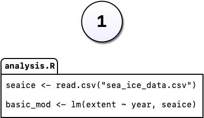
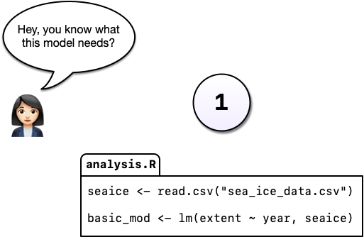
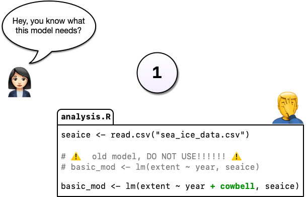
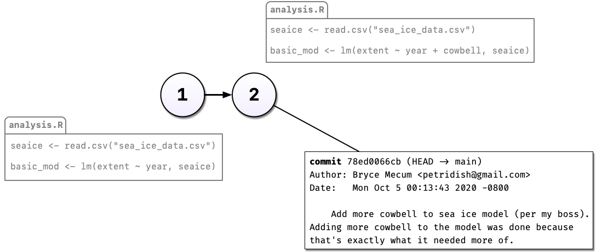
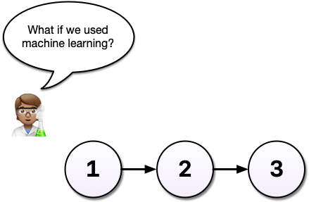
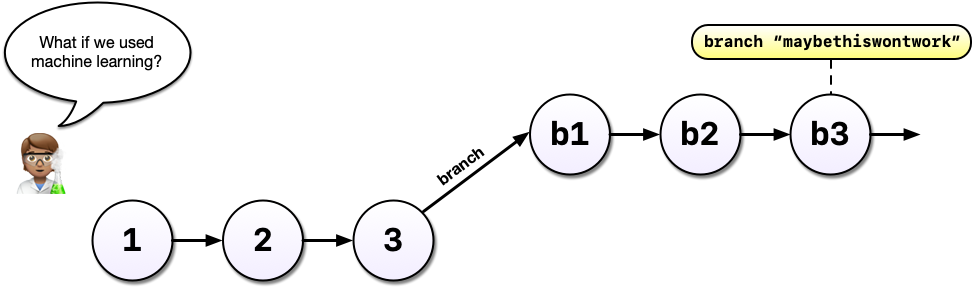
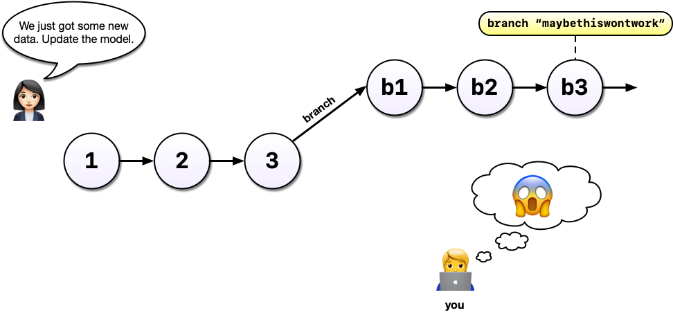
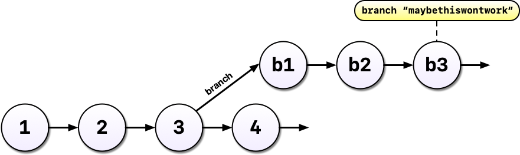
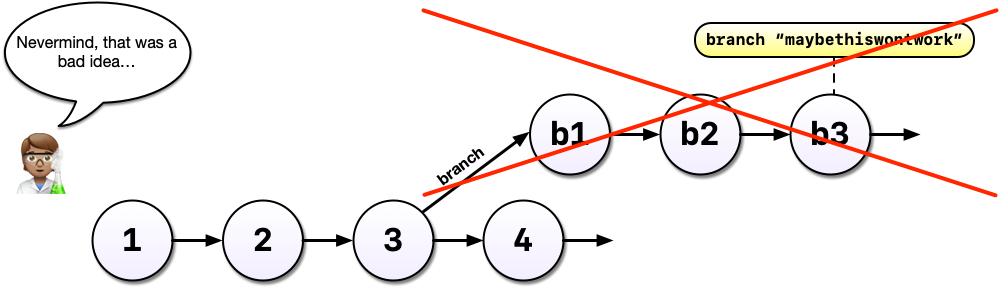
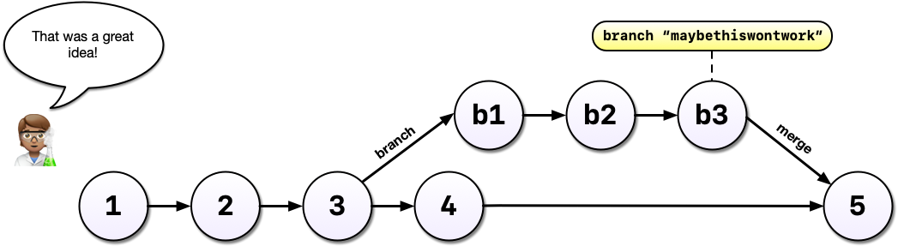

## {#title-slide data-menu-title="Title Slide"} 

[Git & GitHub]{.custom-title}

[A motivating example]{.custom-subtitle}

---

[Version 1]{.custom-subtitle}

::: columns

::::{.column width="70%"} 
{fig-alt="Cartoon graphic of a script called 'analysis.r' containing a simple linear model" width="100%"}
::::

::::{.column width="30%"}
You're working on an analysis in R and you've got it into a state you're pretty happy with. 

We'll call this version 1.
::::

:::
<!-- end columns -->

---

::: columns

::::{.column width="70%"} 
{fig-alt="Cartoon graphic of a script called 'analysis.r' containing a simple linear model with a person with a speech bubble saying 'hey, you know what this model needs'?" width="100%"}
::::
::::{.column width="30%"}
 
The next day, you have an email from your boss, "Hey, you know what this model needs?"
::::

:::

---

{fig-alt="animated gif of Christopher Walken in a leather coat saying 'I gotta have more cowbell baby' in a Saturday Night Live sketch" width="90%"}

---

::: columns
::::{.column width="70%"} 
{fig-alt="Cartoon graphic of a script called 'analysis.r' containing a more complicated linear model with a person with a speech bubble saying 'hey, you know what this model needs'? and another person with their face in their hands" width="100%"}
::::

::::{.column width="30%"}
   Your boss demands more cowbell. So you add it to the model.
::::
:::

[But you're worried about losing the old model. So you comment out the old code and put a **serious warning** in a comment above it.]{style="font-size: 0.9em;"}

---

::: columns
::::{.column width="70%"} 
{fig-alt="Cartoon graphic of a script called 'analysis.r' containing a more complicated linear model with a person with a speech bubble saying 'hey, you know what this model needs'? and another person with their face in their hands" width="100%"}
::::

::::{.column width="30%"}
   Commenting out code is common, or saving a new file with the changes, e.g., **`analysis_v2.R`**.
::::
:::

[But it's hard to understand why you did this when you come back years later, or you when you send your script to a colleague.]{style="font-size: 0.9em;"}

---

[Version control!]{.custom-subtitle}

{fig-alt="Cartoon graphic of two versions of a script called 'analysis.r' containing a more simple and more complicated linear model respectively with the Git commit message used when the second version was committed" width="85%" fig-align="center"}

[Instead of commenting out the old code, we can change our code without fear, and tell Git to take a snapshot of our change (make a "commit").]{style="font-size: 0.8em;"} 

---

[Version control!]{.custom-subtitle}

{fig-alt="Cartoon graphic of two versions of a script called 'analysis.r' containing a more simple and more complicated linear model respectively with the Git commit message used when the second version was committed" width="85%" fig-align="center"}

[So now we have two distinct versions of our analysis and we can always see (and recover, if necessary) what the previous version(s) look like.]{style="font-size: 0.8em;"} 

---

[Version control to the rescue!]{.custom-subtitle}

{fig-alt="Cartoon graphic of two versions of a script called 'analysis.r' containing a more simple and more complicated linear model respectively with the Git commit message used when the second version was committed" width="85%" fig-align="center"}

[The reasons for the change are described in the commit message. We can also see when and by whom the change was made.]{style="font-size: 0.8em;"} 

---

:::columns
::::{.column width="50%"}
  
{fig-alt="Cartoon graphic of a person with a speech bubble saying 'what if we used machine learning?'"}
::::

::::{.column width="50%"}
  
After some time, you've committed a 3rd version of your analysis, and a colleague has an idea...
::::
:::

---

:::columns
::::{.column width="50%"}
  
{fig-alt="Cartoon graphic of a person with a speech bubble saying 'what if we used machine learning?'"}
::::

::::{.column width="50%" style="font-size: 0.8em;"}
 
Your current analysis is working well, and you worry this might break it...

 

Without a tool like Git, you might copy `analysis.R` to another file called `analysis-ml.R` which is mostly redundant with your existing code except for a few lines.
::::
:::

:::{style="font-size: 0.8em;"}
This may not be problematic until you want to make a change to a bit of shared code - and now you have to make changes in two files, if you even remember to.
:::

---

Instead, with Git, we can start a new branch, leaving the original version in place. 

{fig-alt="Cartoon graphic of a person with a speech bubble saying 'what if we used machine learning?' over six numbered circles, the first three just with numbers, the last three with a preceding lowercase 'b' and the number with a text label saying 'branch 'maybethiswontwork'" width="90%"}

Branches allow us to confidently experiment on our code, all while leaving the original code intact and recoverable.

---

{fig-alt="Cartoon graphic of a person with a speech bubble saying 'we just got some new data. update the model.' over six numbered circles, the first three just with numbers, the last three with a preceding lowercase 'b' and the number with a text label saying 'branch 'maybethiswontwork'. There is a second person with a thought bubble with a screaming face sitting at their laptop in the bottom corner" width="100%"}
[You've been working in a branch, made a few commits, and your boss emails asking you to update the **original** model.]{style="font-size: 1m;"}

---

 

{fig-alt="Cartoon graphic of seven numbered circles, the first four just with numbers, the last three with a preceding lowercase 'b' and the number with a text label saying 'branch 'maybethiswontwork' and '4' and 'b1' are  both connected to '3' by arrows" width="100%"}

With Git and branches, we can continue developing our main analysis at the same time as we are working on any experimental branches.

---

Outcome 1: **Experimental model: no good!**

{fig-alt="Cartoon graphic of seven numbered circles, the first four just with numbers, the last three with a preceding lowercase 'b' and the number with a text label saying 'branch 'maybethiswontwork' and '4' and 'b1' are  both connected to '3' by arrows. A red 'x' covers all of the 'b' circles and a person with a speech bubble says 'nevermind, this was a bad idea...'" width="100%"}

After all that hard work on the machine learning experiment, you decide to scrap it.  

[It's perfectly fine to leave branches in place and switch back to the main line of development, but we can also delete them to tidy up.]{style="font-size: 0.8em;"}

---

Outcome 2: **Experimental model: success!**

{fig-alt="Cartoon graphic of eight numbered circles, the first four and last one just with numbers, the penultimate three with a preceding lowercase 'b' and the number with a text label saying 'branch 'maybethiswontwork' and '4' and 'b1' are  both connected to '3' by arrows. '4' and 'b3' both connect to '5' and a person with a speech bubble says 'that was a great idea!'" width="100%"}

Your machine learning experiment was a wild success!  You can merge the changes made on your experimental branch back into your main line. 

[Merging branches is analogous to accepting a change in MS Word's "track changes" feature or Google Docs "suggesting" mode.]{style="font-size: 0.8em;"}

---

[Key Benefits of Version Control with Git]{.custom-subtitle}

:::{.body-text style="font-size: 0.8em;"}
* **Safely modify code and files** without fear of losing previous versions: make a change, take a snapshot, and recover the old version if necessary
* **Access the complete change history** of code and files: see what changed, who made the change, when, and why
* **Safely experiment with new ideas**: test new ideas or features without disrupting the working analysis

and later...

* **Collaborate with colleagues** (Git with GitHub): work with multiple team members on the same project safely, simultaneously, and remotely
:::

<!--
---

:::{.body-text}
Years later, your colleague asks you to make sure the model you reported in a paper you published together was actually the one you used. 

Another really powerful feature of Git is **tags** which allow us to record a particular state of our analysis with a meaningful name. 

In this case, we tagged the version of our code we used to run the analysis for the paper. Even if we continued to develop the work after we submitted our manuscript, we can always go back and run the analysis as it was in the past.
:::
-->

