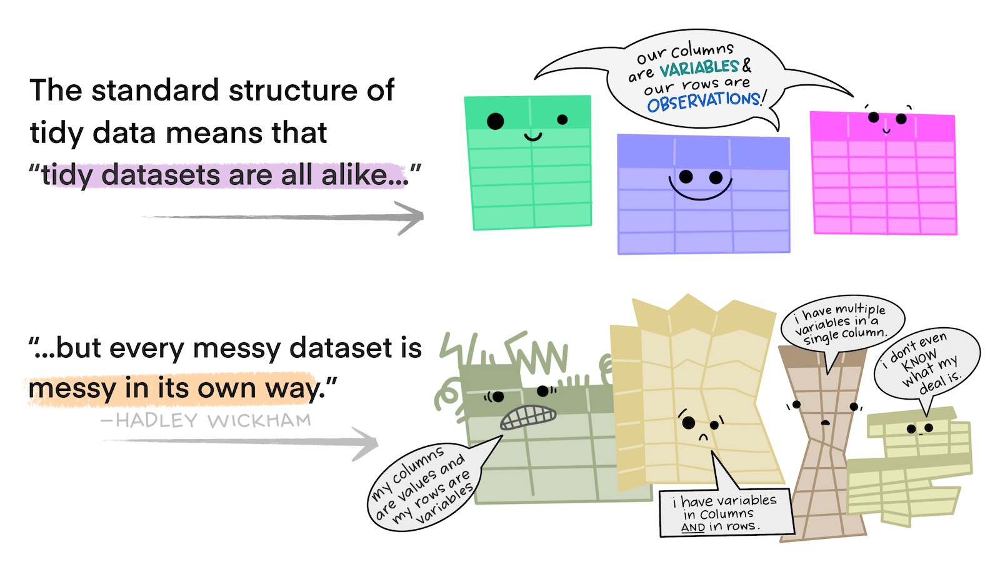
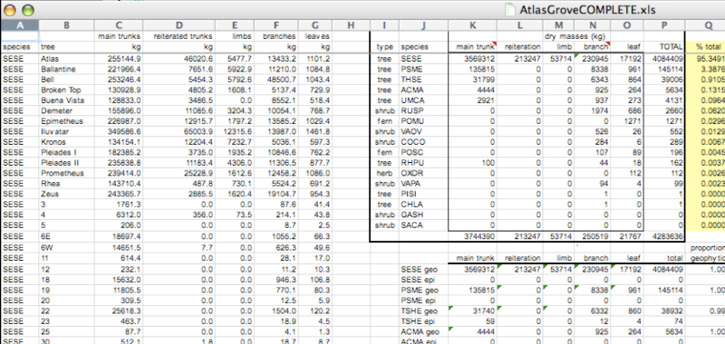
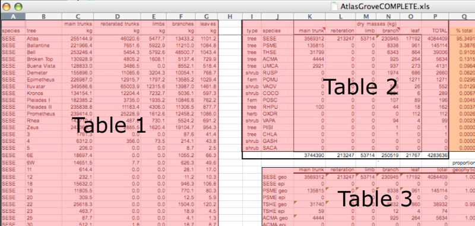
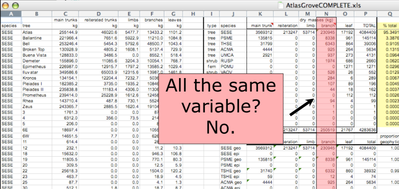
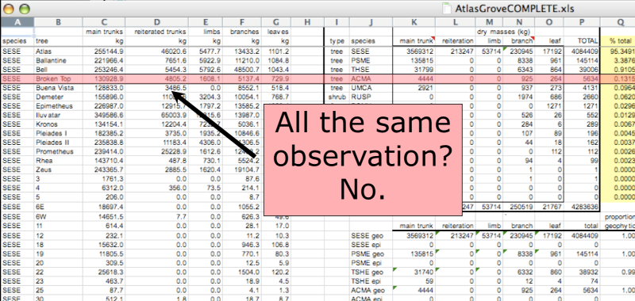
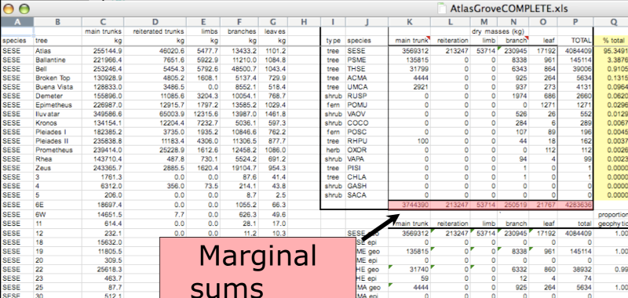
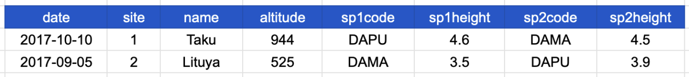
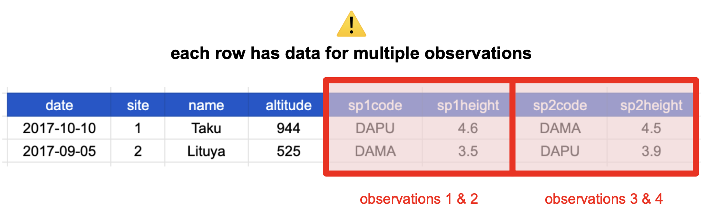
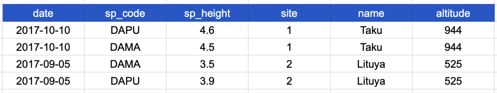

## {#title-slide data-menu-title="Title Slide"} 

[Recognizing Untidy Data]{.custom-title}

{fig-align="center" alt-text="Artwork by @allison_horst CC-BY 4.0.  There are two sets of anthropomorphized data tables. The top group of three tables are all rectangular and smiling, with a shared speech bubble reading 'our columns are variables and our rows are observations!'. Text to the left of that group reads 'The standard structure of tidy data means that 'tidy datasets are all alike…' The lower group of four tables are all different shapes, look ragged and concerned, and have different speech bubbles reading (from left to right) 'my column are values and my rows are variables', 'I have variables in columns AND in rows', 'I have multiple variables in a single column', and 'I don’t even KNOW what my deal is.' Next to the frazzled data tables is text '...but every messy dataset is messy in its own way. -Hadley Wickham.'"}

## Example 1

## Example 1

:::{.column width="70%"}
{.lightbox}
:::

:::{.column width="30%"}
::::{.body-text}
Here is a screenshot of an actual dataset that came across NCEAS.

We have all seen spreadsheets that look like this - whatever this is, it isn't very tidy.
Let's dive deeper into why we consider it untidy data.
::::
:::

## Multiple tables

:::{.column width="70%"}
{.lightbox}
:::

:::{.column width="30%"}
::::{.body-text}
To begin with, notice there are actually three smaller tables within this spreadsheet.
Although for our human brain can interpret this easily, it is difficult to get a computer to see it this way.
::::
:::

## Multiple tables

:::{.column width="70%"}
{.lightbox}
:::

:::{.column width="30%"}
::::{.body-text}
Having multiple tables within the same spreadsheet will create headaches down the road should you try to read in this information using R or another programming language.

**Having multiple tables immediately breaks the tidy data principles**, as we will see next.
::::
:::

## Inconsistent columns
:::{.column width="70%"}
{.lightbox}
:::

:::{.column width="30%"}
::::{.body-text}
In tidy data, **each column corresponds to a single variable**.
If you look down a column, and see that multiple variables exist in the table, the data is not tidy.
A good test for this can be to see if you think the column consists of only one unit type.
::::
:::

## Inconsistent rows
:::{.column width="70%"}
{.lightbox}
:::

:::{.column width="30%"}
::::{.body-text}
The second principle of tidy data is: **every row must be a single observation**.
If you look across a single row, and you notice that there are clearly multiple observations in one row, the data is not tidy.
::::
:::

## Marginal sums and stats: not tidy!
:::{.column width="70%"}
{.lightbox}
:::

:::{.column width="30%"}
::::{.body-text}
They break principle one, "Every column is a single variable", because a marginal statistic does not represent the same variable as the values it is summarizing.

They also break principle two, "Every row is a single observation", because they represent a combination of observations, rather than a single one.
::::
:::

## Example 2
{width="100%" fig-align="center" .lightbox}

## Example 2
{width="70%" fig-align="center" .lightbox}

:::{.body-text}
This table shows data about species observed at a specific site and date.
The columns represent:

-   *date*: date when a species was observed
-   *site*, *name*: site ID and name where a species was observed
-   *altitude*: site's altitude
-   *sp1code*, *sp2code*: species code for two plants observed
-   *sp1height*, *sp2height*: height of the two plants observed

Which tidy data principle(s) does this table break?
:::

## Multiple Observations

{width="70%" fig-align="center" .lightbox}

:::{.body-text}
This table breaks the second tidy data principle: "Every row is a single observation."
Remember that an observation is all the values measured for an individual **entity**.

If our **entity** is a **single observed plant**, then the values we measured are date and site of observation, the altitude, and the species code and height.
:::

## Multiple Observations

{width="70%" fig-align="center" .lightbox}

:::{.body-text}
People often refer to this as "*wide* format", because the observations are spread across a wide number of columns.
Note that, should one encounter a new species in the survey, we would have to add new columns to the table.
This is difficult to analyze, understand, and maintain.
:::

## Multiple Observations

{width="70%" fig-align="center" .lightbox}
:::{.body-text}
To solve this problem, we can create a single column for species code and a single column for species height.  Each observation has been given its own row!
:::
