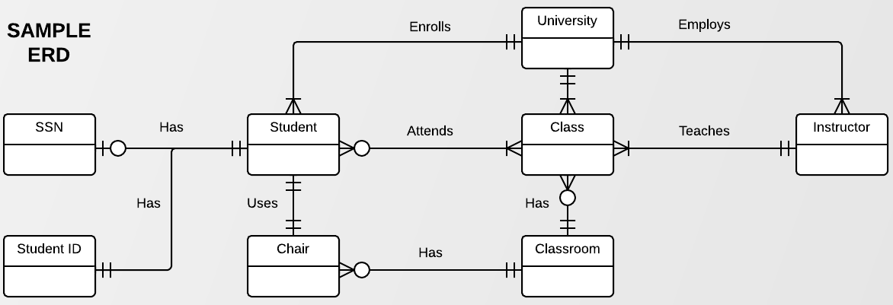
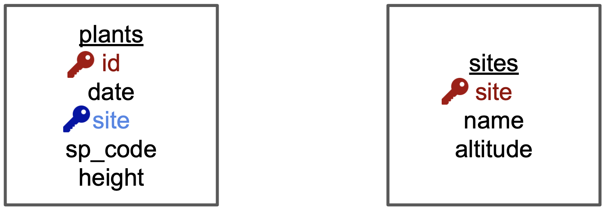
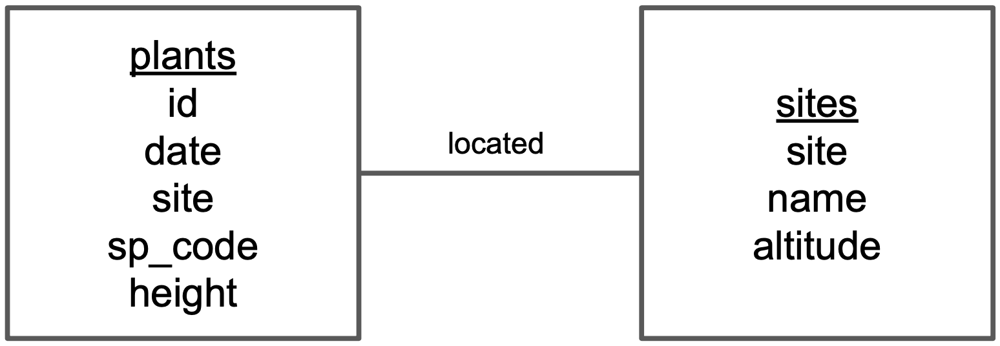
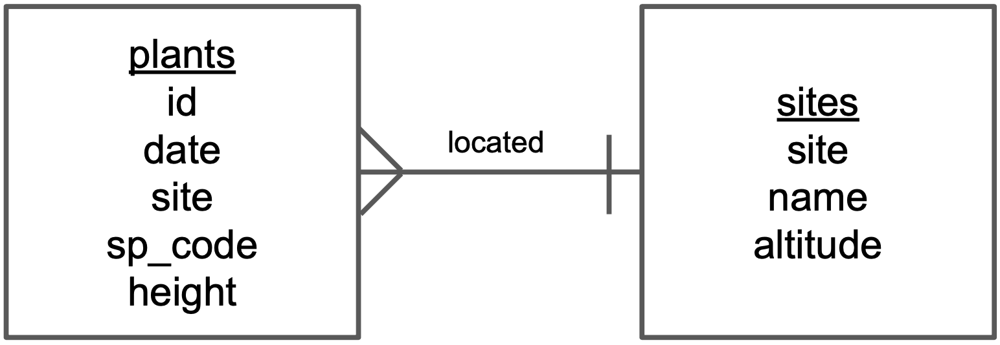
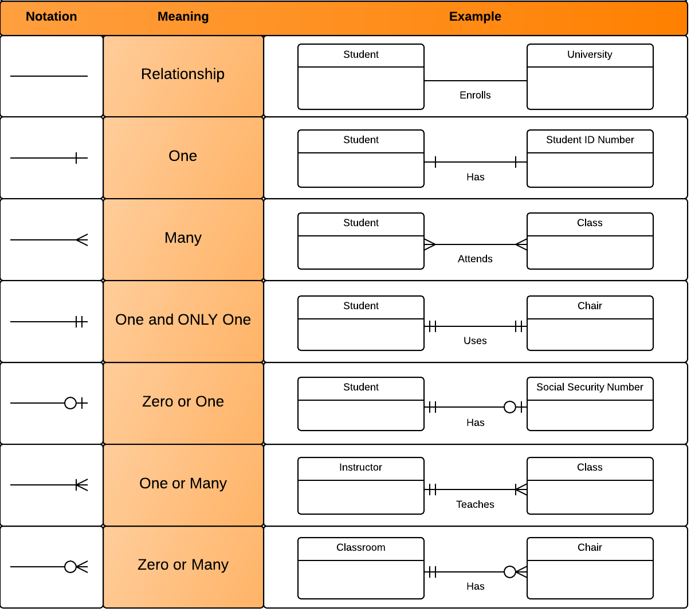

## {#title-slide data-menu-title="Title Slide"} 

[Entity-Relationship Diagrams]{.custom-subtitle}

{fig-align="center" width="90%" alt-text="An example of an entity-relationship diagram. This relates entities involved in university education: student, university, class, instructor, classroom, chair. The student has two attributes: SSN and Student ID.  Relationships are depicted by lines with ending symbols. For example, the relationship between student and class is 'attends' and the symbol at the end of the line near student is 'one or many' while the symbol at the end of the line near student is 'zero or many'."}

---

**Step 1: Identify the entities in the relational database.**

{fig-align="center"}

In our case, entities are **plants** and **sites**, since we are gathering observations about both of these.  Write each entity in a box of its own.

---

**Step 2: Add variables for each entity and identify keys.**

{fig-align="center"}

Add the variables as a list of attributes inside each box. Then, identify the primary and foreign keys in each of the boxes.
To visualize this, we have indicated

-   the  primary key  (of each entity) in  red  and
-   any  foreign keys  in  blue .

---

**Step 3: Add relationships between entities.**

{fig-align="center"}

a)  Draw a line between the boxes of each pair of entities that has a relationship.

:::{.body-text}
Here we only have two entities, and there is a relationship between them.  If we had many entities, not all entities may have a direct relationship (through a primary/foreign key match), so would not be connected by a line.
:::
---

**Step 3: Add relationships between entities.**

{fig-align="center"}

b)  Identify which box has the primary key of the other as a foreign key.  Let's call the box that has the foreign key **box1** and the other box **box2**.

:::{.body-text}
Using the previous diagram we can see that "site" is the primary key of **sites** and appears as a foreign key in **plants**.  So **plants** is **box1** and **sites** is **box2**.
:::

---

**Step 3: Add relationships between entities.**

{fig-align="center"}

c)  Add a word describing how **box1** is related to **box2** above the line connecting the two boxes. So, for example, we need to describe how **plants** is related to **sites**.

:::{.body-text}
The relation between **plants** --> **sites** is "a plant is located in a site", so we write "located" above the line indicating the relationship between **plants** and **sites**.
:::

---

**Step 4: Add cardinality to every relationship in the diagram.**

{fig-align="center"}

Now let's quantify how many items in an entity are related to another entity. This is easiest if we reuse the description we found in the previous step.

:::{.body-text}
In our description of the relationship of **plants** --> **sites**, "a plant is located in one site".  Then we add the symbol for "one" at the end of the line going from **plants** to **sites**.
:::

---

**Step 4: Add cardinality to every relationship in the diagram.**

{fig-align="center"}

We also need to indicate cardinality in the other direction of the relationship.

:::{.body-text}
Since the relationship between **sites** --> **plants** is "a site has many plants", we add the symbol for "many" at the end of the line going from **sites** to **plants**
:::

That's it!

---

**EDR Crow's Foot**

:::{.column width="40%"}
The symbols we used at the end of the lines are called **ERD "crow's foot"**.
This chart shows all the existing symbols:
:::

::: {.column width="60%"}
{fig-align="center" .lightbox alt-text="A diagram showing the different symbols used in ERD crow's foot notation. The symbols are 'one and only one', 'zero or one', 'zero or many', and 'one or many'. Each symbol is shown with an example of a relationship that would be represented by that symbol."}
:::

---

**EDR Crow's Foot**

{fig-align="center" alt-text="A diagram showing the different symbols used in ERD crow's foot notation, using an example of a relationship that would be represented by that symbol."}

Examine the relationships shown in this chart, including the crows foot symbols.  Can you interpret the meaning of each relationship?
